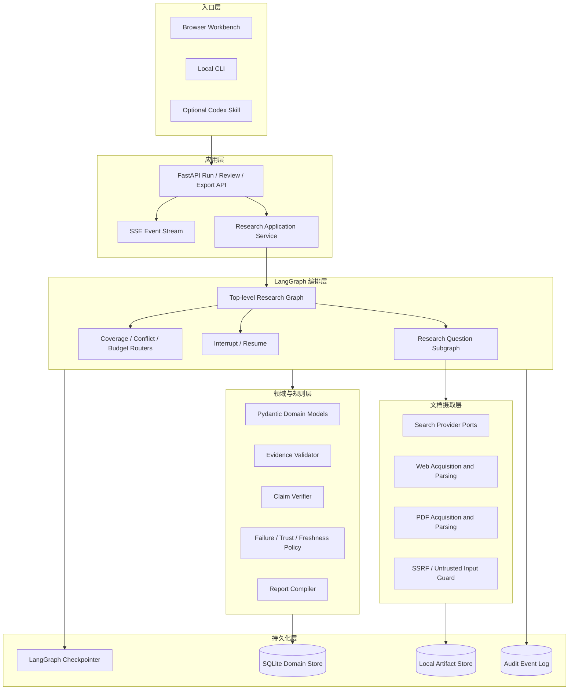
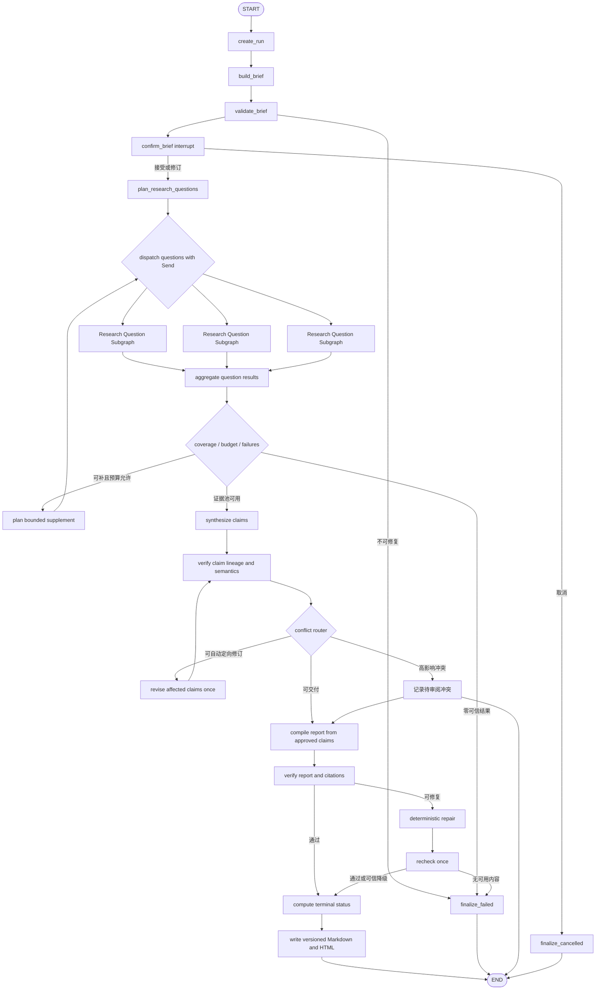
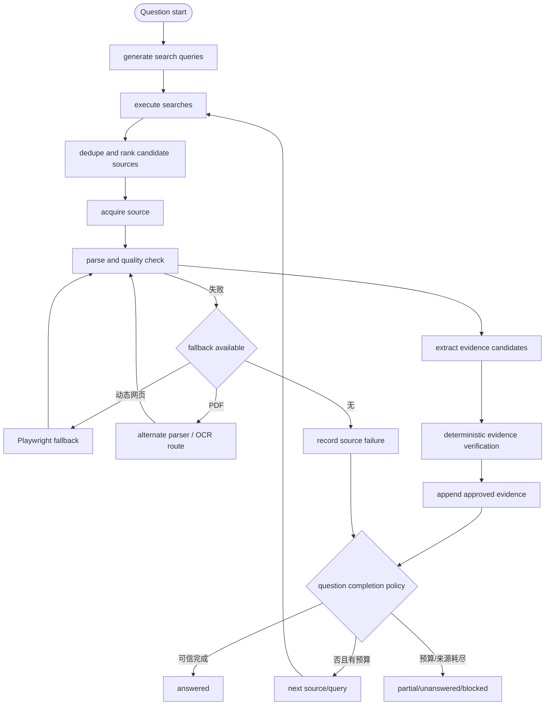

# 能力迁移边界与目标架构设计

> 状态：初稿，待逐节评审  
> 前置依据：`product-and-architecture-decisions.md`、`current-state-audit.md`  
> 本文描述设计，不代表已经实现。

## 1. 决策摘要

新项目采用“独立 Python 服务 + 显式 LangGraph 顶层编排 + LangChain 模型与工具适配 + Pydantic 领域模型”。不在项目 B 上继续叠加聊天/AIOps，也不把项目 A 整体翻译成 Python。

迁移对象不是 PiAgent 的框架代码，而是项目 A 已验证的调研领域不变量：

- 外部事实先形成可定位 Evidence，再形成 Claim；
- 报告只能消费通过门禁的 Claim；
- Source、Evidence、Claim、Citation 使用稳定 ID 保持血缘；
- 网络、解析、模型与校验失败必须有限重试、可见降级并有终点；
- 状态、原始产物和审计事件可持久化，进程中断后可恢复；
- `PARTIAL` 可以不完整，但其中保留的事实仍必须可信；
- L2 语义结论必须参与运行终态，修复项目 A “L2 发现 unsupported 仍 completed”的缺口。

项目 B 提供 Python Web 工程形态和显式 StateGraph 的参考，但不继承其业务图、MemorySaver、mock MCP、Milvus RAG、聊天接口或漂移的依赖基线。

第一版保持本地个人工具：SQLite 保存结构化领域数据，文件系统保存网页/PDF 原件与导出物，使用持久化 LangGraph checkpointer 保存执行位置。未来多人服务化时，领域接口保持不变，再将 SQLite/本地文件替换为 PostgreSQL/对象存储。

## 2. 迁移原则

1. **迁移不变量，不迁移框架外壳**：保留 Evidence-first、引用门禁和恢复策略；不保留 Pi 命令、终端 UI 和 Pi SDK 类型。
2. **确定性规则优先于 Agent 自由度**：URL 校验、正文保存、quote 定位、数字一致性、引用生成、终态判定由代码控制。
3. **模型只做适合模型的工作**：问题分解、查询生成、Evidence 候选提取、Claim 综合和语义支持判断使用结构化模型调用。
4. **编排与领域存储分离**：LangGraph checkpoint 不是 Source/Evidence 数据库，也不是网页/PDF 文件仓库。
5. **大对象不进入 Graph State**：Graph State 保存稳定 ID、状态、计数和 artifact reference；正文保存在 artifact store。
6. **所有循环都有上限**：搜索扩展、重试、补证据、Claim 修订和解析降级都有预算与停止条件。
7. **失败局部化**：单个来源失败不影响无依赖分支；高影响冲突不得被“多数投票”自动掩盖。
8. **终态是可信承诺**：`COMPLETED`、`PARTIAL`、`NEEDS_REVIEW`、`FAILED` 由显式验证结果计算，不由 Reporter 自报。
9. **先单机场景闭环，再多人化**：第一版不提前建设账号、租户、权限和分布式队列，但 repository 接口保留替换边界。
10. **先建立可重复基线，再优化速度**：未通过可信度门禁的快结果不计作效率提升。

## 3. 能力对照表

迁移建议含义：

- **是—复用规则**：复用设计和测试语义；因语言变化通常需要 Python 重写，不代表复制源码。
- **是—LangGraph 化**：保留能力，但由节点、条件边、状态字段或持久化接口承载。
- **延后**：保留扩展点，第一版不进入核心路径。
- **否**：与目标产品无关或框架耦合过深。

| 项目 A 能力 | 当前实现位置 | 主要依赖 | 可迁移价值 | LangGraph / 新架构映射 | 主要风险 | 建议 |
|---|---|---|---|---|---|---|
| Pi 命令与参数入口 | `src/index.ts` | pi-coding-agent | 提供 CLI 交互参考 | 替换为 FastAPI/CLI adapter，调用同一 graph service | 直接移植会把核心绑定 Pi | 否 |
| Brief 结构化理解 | `roles/comprehender.ts`、`types.ts` | Pi model、TypeBox | 把模糊任务转为可审计输入契约 | `build_brief` 节点 + Pydantic `ResearchBrief` | 模型可能生成不合理成功标准 | 是—LangGraph 化 |
| 唯一 Brief 人工确认 | `index.ts` confirm hook | Pi UI | 防止错误目标扩大成本 | `interrupt()`，使用 `Command(resume=...)` 恢复 | API/CLI 必须统一恢复协议 | 是—LangGraph 化 |
| Task DAG 规划与判据绑定 | `roles/planner.ts`、`scheduler.ts` | Pi model | 支持覆盖度与有限并行 | `plan_questions` 节点；问题对象绑定 coverage requirement | 动态计划膨胀、伪覆盖 | 是—LangGraph 化 |
| 拓扑分层并发 | `scheduler.ts` | TypeScript Promise | 减少无依赖任务耗时 | 条件边返回多个 `Send`，每个 ResearchQuestion 进入子图 | 并发写状态冲突、Provider 限流 | 是—LangGraph 化 |
| 搜索 Provider 抽象 | `net/search-provider.ts`、`tools/web-search.ts` | Tavily | 可替换搜索服务、便于 mock | `SearchProvider` port + `discover_sources` 节点 | 单 Provider 偏差、API 变化 | 是—复用规则 |
| 查询缓存与 URL 规范化 | `net/cache.ts`、`tools/env.ts` | 文件系统 | 降成本、去重复抓取 | Cache repository + canonical URL 唯一约束 | 过期缓存造成时效错误 | 是—复用规则 |
| HTTP 分类重试与熔断 | `net/http.ts` | undici | 联网失败不击穿流程 | Python fetch service；节点只消费结构化结果 | 重试放大延迟，429 策略需 Provider 化 | 是—复用规则 |
| SSRF 与重定向逐跳校验 | `net/ssrf-guard.ts`、`http.ts` | DNS、undici | Web 服务必要安全边界 | ingestion gateway 前置校验，不交给模型决定 | DNS rebinding、IPv6/代理差异 | 是—复用规则 |
| HTML 正文抽取与降级 | `net/extract.ts`、`web-fetch.ts` | Readability、linkedom | 静态网页获取基础 | `acquire_source` / `parse_document` 节点；HTTPX + Trafilatura，Playwright 按需降级 | Python 解析器行为与 A 不等价 | 是—LangGraph 化 |
| PDF 解析 | A 无实现 | 无 | 新产品必需来源类型 | ingestion adapter：MinerU 主候选、PyMuPDF 校验/降级 | 部署成本、OCR、表格定位尚未基准测试 | 延后到摄取阶段决策门 |
| 外部内容 untrusted 隔离 | `net/untrusted.ts` | 自定义转义 | 防提示注入和报告注入 | 文档块带 trust metadata；模型 prompt 固定声明；HTML 再转义 | 仅包标签不能阻止所有注入 | 是—复用规则 |
| Source 领域模型与正文落盘 | `types.ts`、`checkpoint.ts` | 文件系统 | 可审计来源与稳定定位 | `Source` 表 + `ArtifactRef` + artifact store | 内容变更、版权与存储空间 | 是—复用规则 |
| exact/normalized/fuzzy quote 定位 | `verify/quote-locator.ts` | 自研算法 | 解决伪造引用的核心能力 | `verify_evidence` 确定性服务/节点 | Python 端口必须保持数字保护和性能上限 | 是—复用规则 |
| Evidence append-only | `tools/evidence-record.ts`、`types.ts` | Pi AgentTool | 保证证据历史不可静默改写 | Evidence repository；节点提交候选，validator 批准后追加 | 并发去重与版本关系 | 是—LangGraph 化 |
| Evidence BM25-lite 查询 | `tools/evidence-query.ts` | 自研 tokenizer | 控制 Reporter 上下文 | Evidence selector service，第一版可用字段/关键词检索 | 中英文召回有限，不适合长期扩展 | 是，但可替换实现 |
| Claim 与 Evidence 血缘 | `types.ts`、`coverage.ts` | 领域模型 | 报告可信度核心 | `synthesize_claims` 输出 Pydantic Claim；repository 强制外键 | 模型错误绑定仍需语义校验 | 是—LangGraph 化 |
| L1 确定性校验 | `verifier-l1.ts`、`report/markdown.ts` | 自研规则 | 零 token、可复现门禁 | `verify_evidence`、`verify_claims`、`verify_report` 三个节点 | 规则覆盖不足或误阻断 | 是—复用规则 |
| L2 逐 Claim 语义校验 | `verifier-l2.ts` | Pi model | 判断证据是否真正支持结论 | 独立 `semantic_verify_claims` 节点，可用不同模型/提示上下文 | 同源模型偏差、成本、非确定性 | 是—LangGraph 化 |
| L2 橡皮图章告警 | `verifier-l2.ts` | 自研规则 | 识别全 supported 异常 | verification summary + eval 指标 | 只是信号，不能单独判失败 | 是—复用规则 |
| 违规引用确定性剔除 | `report/markdown.ts` | 正则与段落规则 | 保证最终报告不保留悬空引用 | 更优做法是报告从 approved Claim 编译；保留最终防线 | 文本级删除可能破坏语义连贯 | 是，但降为最后防线 |
| Markdown 脚注代码重建 | `report/markdown.ts` | 自研渲染 | 防模型伪造来源定义 | Report compiler 从数据库生成 Citation | Markdown 方言与导出兼容 | 是—复用规则 |
| 自包含 HTML 溯源报告 | `report/html.ts` | inline HTML/CSS/JS | 与目标浏览器阅读高度一致 | Jinja/模板编译 + Claim/Evidence 交互；沿用 CSP/转义原则 | 单文件体积、嵌入原文数据泄露 | 是—复用设计，不复制前端 |
| 分层失败策略 | `failure-policy.ts` | 自研计数器 | 防无限循环、支持可解释降级 | retry policy service + route function + Failure state | 不同 Provider 需不同分类 | 是—LangGraph 化 |
| 三维预算 | `budget.ts` | token/cost 统计 | 时间盒与成本控制 | Budget state + 每节点 guard + graph routing | A 是 Task 后检查的软上限 | 是，并强化为调用前后检查 |
| JSON 快照 + JSONL 事件 | `checkpoint.ts`、`replay.ts` | 文件系统 | 审计与崩溃恢复经验 | LangGraph durable checkpointer + 独立 domain event log | 双写一致性、不能把二者混为一层 | 是—改造，不直接移植 |
| researching 阶段续跑 | `run.ts`、`replay.ts` | 自研 orchestrator | 已完成分支不重做 | LangGraph checkpoint/pending writes + 幂等节点 | 外部副作用必须有幂等键 | 是—LangGraph 化 |
| Trace 树 | `observability/trace.ts` | 事件流 | 便于作品展示和问题定位 | SSE custom events + structured audit events + trace UI | 日志含敏感输入 | 是—改造 |
| Pi Model / AgentTool 调用封装 | `roles/llm.ts`、`tools/*.ts` | Pi SDK | 结构化调用和超时语义有价值 | LangChain model、ToolStrategy/Pydantic、RunnableConfig | 直接端口会保留错误抽象 | 只复用语义 |
| 面试学习台功能 | `interview-prep-*` | HTML/JS | 与售前调研无关 | 无映射 | 扩大产品边界 | 否 |

项目 B 的能力按目标项目处理如下：

| 项目 B 能力 | 当前实现位置 | 处理方式 | 原因 |
|---|---|---|---|
| FastAPI 应用分层 | `app/main.py`、`app/api`、`app/services` | 参考目录职责，重新建项目 | Web 后端形态适合，但当前全局单例和强 Milvus 启动依赖不应继承 |
| 显式 StateGraph | `services/aiops_service.py` | 复用建图经验，不复用业务图 | Planner/Executor/Replanner 状态无法表达研究不变量 |
| `create_agent` 聊天 | `rag_agent_service.py` | 不迁移主流程 | 消息中心 Agent 不适合顶层长流程；局部工具型子节点可使用 |
| MemorySaver | 两个 Agent service | 仅测试可用 | 进程重启即丢，不能满足恢复与审计 |
| SSE | `api/chat.py`、`api/aiops.py` | 复用传输思路，重新定义事件 schema | 当前上下游事件不完全一致 |
| Pydantic Settings | `config.py` | 可复用模式 | 需要移除 import-time 副作用并分环境校验 |
| MCP Client + retry interceptor | `agent/mcp_client.py` | 延后为可选 tool adapter | 第一版公网调研无真实 MCP 依赖，当前 server 都是 mock |
| Milvus RAG | `services/vector_*` | 第一版不迁移 | 不做内部知识库，Evidence 是结构化事实库而非向量聊天库 |
| 文档分块 | `document_splitter_service.py` | 不直接迁移 | 仅 txt/md，缺少 PDF、网页定位和解析质量模型 |
| Loguru | `utils/logger.py` | 可替换为结构化 logging | 当前日志有输入泄露和 diagnose 风险 |
| 静态聊天前端 | `static/` | 不迁移 | 目标是研究工作台与报告审阅，不是聊天 UI |
| mock CLS/Monitor MCP | `mcp_servers/` | 不迁移 | 与产品边界无关且数据非真实 |

## 4. 直接复用、改造与舍弃边界

### 4.1 应直接复用的领域规则或基础设施设计

这里的“直接复用”是复用行为、数据语义与测试夹具，Python 项目中重新实现：

- Source URL 规范化、内容 hash、抓取策略和来源等级；
- HTTP 错误分类、有限重试、429 Retry-After、熔断与响应体上限；
- SSRF、DNS/IP/端口和逐跳重定向检查；
- 外部正文作为不可信数据的边界；
- quote exact / normalized / fuzzy 定位、短引用保护和数字一致性；
- Evidence 的 quote 与 summary 分离、append-only；
- Claim—Evidence—Source 稳定 ID 与血缘；
- L1 确定性校验、代码生成脚注和 HTML 安全原则；
- 失败必须有硬上限、零证据不生成事实报告；
- A 中对应上述行为的测试语义和故障注入样例。

### 4.2 应改造成 LangGraph 节点、路由或状态字段的能力

| 原能力 | 新承载形式 |
|---|---|
| Comprehender | `build_brief` 节点，输出 Pydantic Brief |
| Brief 确认 | `interrupt()` + resume command |
| Planner | `plan_research_questions` 节点 |
| Task DAG 并发 | 条件边 + `Send` 分发 ResearchQuestion 子图 |
| Executor Agent loop | 受控 ResearchQuestion 子图，不允许自由无限循环 |
| 搜索与抓取 | 确定性节点调用 provider/ingestion service；模型只生成查询和候选选择 |
| Evidence record tool | `extract_evidence_candidates` + `verify_evidence` 两阶段节点 |
| Task 证据门槛 | coverage router：完成、补搜、gap 或 review |
| Re-plan | bounded supplement router，只对缺口生成增量问题 |
| Reporter | `synthesize_claims` 与 `compile_report` 分离 |
| L1 / L2 | 独立 verification nodes；结果写入状态并决定终态 |
| Budget | 状态字段 + 每个外部调用前后 guard |
| Checkpoint / resume | durable checkpointer + 幂等 artifact/domain writes |
| Trace | graph stream event + domain audit event |

### 4.3 不应迁移的 PiAgent 框架耦合代码

- `src/index.ts` 的 Pi 命令注册、`pi.sendMessage`、终端确认和 flag 解析；
- `Model<any>`、Pi model registry、OAuth header 获取方式；
- `AgentTool`、Pi tool result content block 类型；
- 直接依赖 Pi agent loop 的 role runner；
- `.codebuddy/research` 作为目标项目内部固定协议；
- TypeScript 专用的流式/API 适配细节；
- 面试学习台及其 UI、状态和测试；
- 任何为了保持 Pi 兼容而扭曲 Python 领域模型的适配层。

### 4.4 不应从项目 B 迁移的业务代码

- chat、chat_stream、session history 等通用聊天能力；
- AIOps Planner—Executor—Replanner 业务图与固定诊断 prompt；
- CLS/Monitor mock MCP Server；
- Milvus 内部知识库链路；
- import 时创建依赖外部密钥的全局 Embedding 单例；
- Milvus 失败导致整个 FastAPI 无法启动的生命周期设计；
- 当前不一致的 SSE 事件分支和 HTTP 200 + body code 500 错误约定；
- 当前 pyproject/uv.lock 组合。

## 5. 目标技术架构

### 5.1 逻辑架构



### 5.2 分层职责

| 层 | 负责 | 不负责 |
|---|---|---|
| 入口层 | 创建 run、查看进度、Brief 确认、审阅 Claim、导出 | 不持有核心状态，不编排节点 |
| FastAPI 应用层 | 鉴权边界预留、请求校验、调用 graph、SSE 映射 | 不实现搜索策略与证据规则 |
| LangGraph 编排层 | 生命周期、分支、并行、循环、暂停恢复、终态路由 | 不保存大正文，不替代领域数据库 |
| 领域层 | 数据不变量、Evidence/Claim 验证、状态判定、报告编译 | 不直接依赖 HTTP 或具体模型 Provider |
| 摄取层 | 搜索、下载、解析、快照、质量评估 | 不生成最终 Claim |
| 持久化层 | checkpoint、结构化实体、原件、事件 | 不决定业务规则 |

### 5.3 建议目录结构

```text
sales-research-agent/
├── pyproject.toml
├── uv.lock
├── src/sales_research_agent/
│   ├── api/
│   │   ├── app.py
│   │   ├── dependencies.py
│   │   ├── routes_runs.py
│   │   ├── routes_review.py
│   │   └── routes_exports.py
│   ├── application/
│   │   ├── run_service.py
│   │   ├── run_supervisor.py
│   │   ├── review_service.py
│   │   └── export_service.py
│   ├── graph/
│   │   ├── builder.py
│   │   ├── state.py
│   │   ├── routing.py
│   │   ├── events.py
│   │   ├── nodes/
│   │   │   ├── brief.py
│   │   │   ├── planning.py
│   │   │   ├── research.py
│   │   │   ├── evidence.py
│   │   │   ├── claims.py
│   │   │   ├── verification.py
│   │   │   └── reporting.py
│   │   └── subgraphs/research_question.py
│   ├── domain/
│   │   ├── models.py
│   │   ├── enums.py
│   │   ├── policies.py
│   │   ├── lineage.py
│   │   └── errors.py
│   ├── ingestion/
│   │   ├── search.py
│   │   ├── http.py
│   │   ├── ssrf.py
│   │   ├── web_parser.py
│   │   ├── pdf_parser.py
│   │   ├── quality.py
│   │   └── models.py
│   ├── verification/
│   │   ├── quote_locator.py
│   │   ├── evidence_validator.py
│   │   ├── claim_support.py
│   │   ├── coverage.py
│   │   └── report_validator.py
│   ├── reporting/
│   │   ├── compiler.py
│   │   ├── markdown.py
│   │   ├── html.py
│   │   └── templates/
│   ├── infrastructure/
│   │   ├── settings.py
│   │   ├── models.py
│   │   ├── checkpoint.py
│   │   ├── repositories.py
│   │   ├── artifacts.py
│   │   └── telemetry.py
│   └── cli.py
├── tests/
│   ├── unit/
│   ├── integration/
│   ├── contract/
│   ├── fault_injection/
│   └── fixtures/
├── evals/
├── docs/
└── var/                  # gitignored local runtime data
```

目录是职责设计，不要求第一天创建所有空文件。实现时按迁移阶段增量增加。

## 6. 核心数据流与 LangGraph 拓扑

### 6.1 顶层 Graph



### 6.2 Research Question 子图

每个问题独立运行，输入只包含该问题、Brief 的必要片段、预算切片和已有来源 ID：



### 6.3 为什么不让单个 Agent 自由跑完整流程

单一 `create_agent` 工具循环适合边界较小的局部任务，但不适合作为顶层研究控制器：

- 模型可能跳过 Evidence 写入直接写结论；
- 工具重试与停止条件难以从消息历史稳定计算；
- 并行问题、预算分配、冲突路由和 human-in-the-loop 需要显式状态；
- 报告上下文容易混入未经验证网页正文；
- 崩溃恢复时难以判断哪些副作用已经完成。

因此局部节点可以使用 LangChain structured output 或受限 Agent，但节点出口必须是 Pydantic 对象，并经过确定性 validator 后才能更新领域状态。

### 6.4 关键数据流规则

1. UserContext 与公网 Source 分库存放；UserContext 可影响问题规划，但默认不能成为 Evidence。
2. 搜索结果摘要只用于来源发现，不能直接成为高影响事实 Evidence；需要明确降级时才能作为低等级线索。
3. 原始 HTML/PDF、解析文本与定位映射写 artifact store；Graph State 只保存 artifact_id。
4. 模型输出的是 EvidenceCandidate；只有 validator 通过后才成为 Evidence。
5. 模型输出的是 ClaimCandidate；只有结构与语义支持通过后才成为可报告 Claim。
6. Report compiler 不访问原始网页，也不自由生成事实，只组织 approved Claim、Gap 和 VerificationResult。
7. HTML 与 Markdown 从同一个 ReportModel 编译，避免两种输出事实漂移。
8. 每次补充调研在同一 run_id 下创建新 report_version，旧 Source/Evidence/Claim 和审阅事件不删除。

## 7. 核心状态与持久化模型

### 7.1 Graph State

下面是逻辑字段，不是最终 Python 代码：

```text
ResearchState
  schema_version
  run_id
  thread_id
  execution_status             # CREATED/RUNNING/INTERRUPTED/CANCELLED/FINISHED
  report_outcome?              # COMPLETED/PARTIAL/NEEDS_REVIEW/FAILED
  current_phase
  brief_id
  user_context_id
  research_question_ids[]
  active_question_ids[]
  source_ids[]                 # reducer: stable-id union
  evidence_ids[]               # reducer: append unique
  claim_ids[]                  # 当前版本引用；实体本身不可静默覆盖
  gap_ids[]
  failure_ids[]
  verification_result_ids[]
  report_version_id?
  budget_snapshot
  retry_counters
  supplement_round
  pending_review_ids[]
  terminal_reason?
  updated_at
```

State 中不保存：完整 HTML、PDF 二进制、整页正文、所有 Prompt、整份报告字符串或无限增长的消息历史。

并行节点对列表字段不能使用简单 `operator.add`：重试会造成重复。需要稳定 ID 去重 reducer，或者让节点先写领域库、Graph State 只合并唯一 ID。

### 7.2 核心领域实体

| 实体 | 关键字段 |
|---|---|
| ResearchRun | run_id、execution_status、report_outcome、phase、as_of_date、brief_id、budget、started/ended_at、schema_version |
| UserContext | 客户名、会议主题、已知需求、来源类型、敏感级别、可外发标记 |
| ResearchBrief | goal、scope、exclusions、scenario_profile、module_ids、assumptions、completion_policy |
| ResearchQuestion | question_id、text、importance、required、status、depends_on、search_budget、completion_rule |
| Source | source_id、URL、final_url、title、domain、tier、published/event/retrieved_at、freshness、artifact refs、content hash、parser version |
| DocumentBlock | block_id、source_id、text_artifact_ref、heading path、page、bbox/DOM locator、extraction method |
| Evidence | evidence_id、source_id、block_id、quote、locator、summary、stance、match level、numbers、validation status |
| Claim | claim_id、type、text、impact、evidence_ids、upstream_claim_ids、support/freshness status、limitations、version |
| ResearchGap | gap_id、question_id、reason、attempts、failed source/query ids、impact、suggested follow-up |
| Failure | failure_id、scope、category、retryability、attempt、strategy、outcome、safe message、technical detail ref |
| VerificationResult | target_type/id/version、rule/model、verdict、reasons、evidence_ids、created_at |
| ReportVersion | report_version_id、run_id、claim/gap snapshot、status、artifact refs、created_at |
| ReviewEvent | target id/version、decision、comment、actor、timestamp、inherited_from_version? |

### 7.3 执行状态与四种报告结果

运行控制和报告可信结果是两条不同状态轴：

- `execution_status` 描述任务是否 CREATED、RUNNING、INTERRUPTED、CANCELLED 或 FINISHED；
- `report_outcome` 只在系统尝试形成报告结果后计算，取 COMPLETED、PARTIAL、NEEDS_REVIEW 或 FAILED；
- 用户在尚未形成报告时取消，`execution_status=CANCELLED` 且 `report_outcome` 为空，不伪装成 FAILED；
- 用户选择“提前停止并基于已有证据结报”不是取消，而是继续验证并计算 PARTIAL/NEEDS_REVIEW/FAILED。

四种报告结果不在基线前写死未经验证的百分比阈值，先使用类别门禁：

- **COMPLETED**：所有必需问题达到 completion rule；报告中的全部事实 Claim 通过结构和语义支持；没有未裁决的高影响冲突；报告校验通过。
- **PARTIAL**：至少存在可用且全部通过可信门禁的 Claim，但一个或多个必需问题因公开资料、预算或工具失败未完成；缺口完整披露。
- **NEEDS_REVIEW**：存在系统不能自动裁决的高影响冲突、Evidence 定位/语义歧义或关键时效问题；不能伪装为已验证完成。
- **FAILED**：无法形成任何可信可用报告、核心状态损坏且不能安全恢复，或关键系统错误使流程无法继续。

人工审阅进度与 `report_outcome` 分开；用户尚未读报告不等于 `NEEDS_REVIEW`。

### 7.4 三层持久化

| 存储 | 第一版 | 保存内容 | 恢复职责 |
|---|---|---|---|
| LangGraph Checkpointer | 持久化 SQLite checkpointer 候选，最终按兼容性验证 | 每个 superstep 的 Graph State、pending writes、interrupt | 恢复执行位置，避免成功并行节点重跑 |
| Domain Store | SQLite + repository 接口 | Source/Evidence/Claim/Gap/Verification/Review 等关系数据 | 保证实体与版本血缘、查询和事务 |
| Artifact Store | 本地 `var/runs/<run_id>/...` | 原始响应、HTML/PDF、解析文本、定位映射、Markdown/HTML 导出 | 保证原件可复核和大对象不污染状态 |
| Audit Event Log | SQLite 表或 append-only JSONL，经接口封装 | 节点、工具、失败、预算、状态变化 | 可观测、调试和评测，不作为唯一权威状态 |

Graph checkpoint 与 domain write 之间不存在自动分布式事务。节点必须：

- 使用 `(run_id, operation_type, stable_input_hash)` 作为幂等键；
- artifact 先写临时文件并原子 rename；
- domain repository 使用唯一约束/upsert 或 append-only version；
- 节点重放时检测已有成功结果并返回相同 ID；
- 外部搜索/模型调用记录 request fingerprint，避免恢复后无限重复收费。

## 8. 关键技术选型及替代方案

| 关注点 | 建议选择 | 替代方案 | 当前理由与边界 |
|---|---|---|---|
| 顶层编排 | LangGraph Graph API | 单一 LangChain agent、Temporal、Prefect、自研 FSM | 需要显式状态、循环、并行、持久化和 HITL；第一版规模不值得引入通用工作流平台 |
| 模型/工具抽象 | LangChain | 直接调用厂商 SDK、LiteLLM | Structured output、tool、Runnable 与 LangGraph 一致；Provider 特性仍通过 adapter 隔离 |
| Schema | Pydantic v2 | dataclass、TypedDict-only | API、模型结构化输出与领域校验统一；Graph State 可用 TypedDict，但实体使用 Pydantic |
| Web API | FastAPI | Flask、Django、LangGraph Server | 用户目标偏 Python 后端，SSE 与类型契约清晰；本地版无需 Django；是否采用 LangGraph Server 延后 |
| 本地领域数据库 | SQLite | JSON 文件、PostgreSQL | 单用户低运维，关系和事务优于散落 JSON；repository 为后续 PostgreSQL 预留 |
| 原始产物 | 本地文件系统 | SQLite BLOB、S3/MinIO | 大对象简单、可人工查看；多人化后换对象存储 |
| Graph checkpoint | 持久化 saver（SQLite 候选，需版本验证） | MemorySaver、PostgresSaver | MemorySaver 不满足重启恢复；生产后可换 Postgres |
| 搜索 | Provider port，首个实现通过小样评测选择 | Tavily、Bing、Brave、Serper、自建聚合 | 不把 Provider 名写入领域层；对中文企业与官方来源覆盖实测后定 |
| 静态网页 | HTTPX + Trafilatura 候选 | aiohttp、Readability port、BeautifulSoup | 同步/异步生态成熟，正文抽取效果需样本验证 |
| 动态网页 | Playwright 按需降级 | Selenium、第三方 browser API | 仅静态解析失败且值得继续时启用，避免默认高成本 |
| PDF | MinerU 主候选 + PyMuPDF 校验/降级 | Docling、Unstructured、云 OCR、pypdf/pdfplumber | 用户已有 MinerU 正向经验，但 backend/硬件/表格与扫描件尚未评测，不提前冻结部署方式 |
| Report | 单一 ReportModel → Markdown + HTML compiler | 模型分别生成两种格式 | 保证事实、状态和引用一致；HTML 使用模板与严格转义 |
| 进度流 | SSE | WebSocket、轮询 | 单向长任务事件足够；审阅操作仍走普通 HTTP |
| 观测 | 结构化 domain events + 标准 logging；OpenTelemetry/LangSmith 可选 | 仅 Loguru 文本 | 本地可审计优先，不强绑定 SaaS；模型 trace 必须做敏感字段控制 |
| 评测 | pytest + 固定夹具 + fault injection + 小型人工事实集 | 只做端到端人工验收 | 可信规则多数可做确定性自动测试，语义支持仍需人工抽样 |

依赖策略：新项目从空白 `pyproject.toml` 建立兼容版本集合，不复制项目 B 的声明或锁文件。依赖版本必须由同一次 `uv lock` 生成，并在 CI 或本机通过 `uv sync --locked` 验证。

## 9. 分阶段迁移计划

阶段不是按“页面看起来完整”排序，而是按风险从证据内核向外扩展。任何阶段失败都不修改项目 A/B；新项目始终可以回到上一阶段 tag。

### 阶段 0：可复现骨架与评测基线

**目标**：先证明 Python 环境、契约和样例可重复，不实现真实调研。

**涉及文件**：

- `pyproject.toml`、`uv.lock`
- `src/sales_research_agent/infrastructure/settings.py`
- `src/sales_research_agent/domain/enums.py`
- `tests/conftest.py`
- `tests/fixtures/`：静态 HTML、PDF 元数据、搜索结果、失败响应
- `evals/cases/haier_first_meeting.yaml`
- `.env.example`、`.gitignore`

**验收标准**：

- Python 3.11 环境可通过 `uv sync --locked` 重建；
- 包可 import，import 不创建网络连接、不要求实际密钥、不写运行文件；
- 首个海尔智家验收任务只定义输入、人工核验点和预期边界，不预置答案；
- fixture 不含真实实习客户或敏感信息；
- README 清楚区分模拟测试与真实运行。

**回归风险**：过早引入全部候选依赖导致安装体积大、MinerU 环境绑死；测试夹具把旧网页事实当永久真值。

**测试命令**：

```powershell
uv sync --locked --extra dev
uv run python -c "import sales_research_agent"
uv run pytest tests/unit tests/contract -q
uv run ruff check src tests
uv run pyright
```

**回滚方案**：删除阶段 0 新增的空白骨架并回到初始化 tag；不触碰 A/B。若某候选重依赖阻塞安装，将其移到 optional extra，不降低领域契约。

### 阶段 1：Evidence / Claim 可信内核

**目标**：先迁移项目 A 最有价值、可确定性验证的能力，不接真实网络和 LLM。

**涉及文件**：

- `domain/models.py`、`lineage.py`、`policies.py`、`errors.py`
- `verification/quote_locator.py`
- `verification/evidence_validator.py`
- `verification/coverage.py`
- `verification/report_validator.py`
- `reporting/markdown.py`
- `infrastructure/repositories.py`
- `tests/unit/test_quote_locator.py`
- `tests/unit/test_evidence_validator.py`
- `tests/unit/test_lineage.py`
- `tests/unit/test_terminal_status.py`

**验收标准**：

- exact / normalized / fuzzy 定位可返回原文范围；
- 数字、金额、百分比或日期被改动时 Evidence 拒收；
- 短 quote 不允许 fuzzy；
- 事实 Claim 没有 approved Evidence 时不能进入 ReportModel；
- L2 `unsupported/conflicting` 的高影响事实不能得到 COMPLETED；
- PARTIAL 中保留的事实与 COMPLETED 使用同一可信门槛；
- Source/Evidence/Claim ID 和版本不可静默覆盖；
- 从项目 A 迁移的关键用例建立 Python 对等测试，而不是只测 happy path。

**回归风险**：TypeScript 与 Python Unicode 归一化差异；fuzzy 算法性能退化；规则过严导致真实 PDF quote 大量拒收。

**测试命令**：

```powershell
uv run pytest tests/unit/test_quote_locator.py -q
uv run pytest tests/unit/test_evidence_validator.py tests/unit/test_lineage.py -q
uv run pytest tests/unit/test_terminal_status.py -q
uv run pytest tests/unit --cov=sales_research_agent.domain --cov=sales_research_agent.verification
```

**回滚方案**：保留 Pydantic 实体和 fixture，回退具体 locator/validator 实现；以项目 A 的测试语义作为对照，不通过时不得继续接报告生成。

### 阶段 2：网页与 PDF 摄取

**目标**：在不接完整 Graph 的情况下，把 URL/PDF 变成带稳定定位的 DocumentBlock。

**涉及文件**：

- `ingestion/models.py`、`search.py`、`http.py`、`ssrf.py`
- `ingestion/web_parser.py`、`pdf_parser.py`、`quality.py`
- `infrastructure/artifacts.py`
- `tests/unit/test_ssrf.py`、`test_web_parser.py`、`test_pdf_parser.py`
- `tests/integration/test_ingestion_pipeline.py`
- `tests/fault_injection/test_network_failures.py`

**验收标准**：

- 拒绝私网、环回、危险端口与重定向到私网；
- 下载大小、超时、重试和重定向次数均有上限；
- 静态网页优先，只有质量不达标才进入动态降级；
- PDF 保存文件 hash、页码、文本块和可用 bbox/提取方式；
- 解析失败生成 Failure/Gap，不抛穿整个批次；
- 原始文件、解析文本和 locator map 可从 artifact_id 重新读取；
- 用财报、普通网页、JS 网页、扫描 PDF、表格 PDF 小样比较 MinerU/PyMuPDF 和网页解析候选，形成选型记录。

**回归风险**：Playwright/MinerU 安装与模型缓存过重；动态页行为不确定；网页条款与版权；PDF 页码/bbox 在不同解析器间不一致。

**测试命令**：

```powershell
uv run pytest tests/unit/test_ssrf.py tests/unit/test_web_parser.py -q
uv run pytest tests/unit/test_pdf_parser.py -q
uv run pytest tests/integration/test_ingestion_pipeline.py -q
uv run pytest tests/fault_injection/test_network_failures.py -q
```

**回滚方案**：通过 parser adapter 关闭未达标的动态或 MinerU backend，回退到静态网页/PyMuPDF 基础路径；失败来源标记 unsupported，不允许退回搜索摘要伪装正文。

### 阶段 3：LangGraph 生命周期、并行与恢复

**目标**：把 Brief—Plan—Research—Coverage 编成可暂停、可恢复、有预算上限的 Graph，先使用 fake model/search。

**涉及文件**：

- `graph/state.py`、`builder.py`、`routing.py`、`events.py`
- `graph/nodes/brief.py`、`planning.py`、`research.py`、`evidence.py`
- `graph/subgraphs/research_question.py`
- `infrastructure/checkpoint.py`、`telemetry.py`
- `application/run_service.py`
- `tests/integration/test_graph_happy_path.py`
- `tests/integration/test_graph_resume.py`
- `tests/integration/test_parallel_questions.py`
- `tests/fault_injection/test_graph_failures.py`

**验收标准**：

- Brief 确认可以 interrupt 并在相同 thread_id 恢复；
- 动态 ResearchQuestion 使用 `Send` 并行，无重复 Evidence ID；
- 某分支失败不重跑已成功的无依赖分支；
- 进程中断后可从持久 checkpoint 恢复；
- 节点重放不会重复写 Source/Evidence 或重复生成 artifact；
- 时间、token、成本、查询、抓取和补充轮次均有限；
- 达到 30 分钟时间盒后停止扩展研究并路由到可信 PARTIAL/NEEDS_REVIEW/FAILED；
- 不再出现项目 A“非 researching 阶段只能新建 run 从头跑”的缺口。

**回归风险**：并行 reducer 重复；checkpoint 与领域库双写不一致；恢复后重复付费；interrupt API 版本差异。

**测试命令**：

```powershell
uv run pytest tests/integration/test_graph_happy_path.py -q
uv run pytest tests/integration/test_graph_resume.py -q
uv run pytest tests/integration/test_parallel_questions.py -q
uv run pytest tests/fault_injection/test_graph_failures.py -q
```

**回滚方案**：通过配置把并发度降为 1；保留领域实体与摄取结果，回退 graph builder/routing 到上一 tag。checkpoint schema 升级必须带版本和迁移检查，不能覆盖旧运行。

### 阶段 4：Claim 综合、语义门禁与双格式报告

**目标**：接入结构化模型调用，把 approved Evidence 转为 Claim，并由同一 ReportModel 输出 HTML/Markdown。

**涉及文件**：

- `graph/nodes/claims.py`、`verification.py`、`reporting.py`
- `verification/claim_support.py`
- `reporting/compiler.py`、`markdown.py`、`html.py`
- `reporting/templates/report.html.j2`
- `application/export_service.py`
- `tests/contract/test_model_structured_output.py`
- `tests/integration/test_claim_pipeline.py`
- `tests/integration/test_report_consistency.py`
- `tests/security/test_report_xss.py`

**验收标准**：

- 模型输出不符合 Schema 时有限重试并收敛；
- Verifier 看到 direct、related 和 refuting Evidence；
- 高影响 unsupported/conflicting Claim 进入 NEEDS_REVIEW 或被排除，不能 COMPLETED；
- Report compiler 只读取 approved Claim 和已披露 Gap；
- 执行摘要不生成正文不存在的新 Claim；
- HTML 与 Markdown 的 Claim ID、Citation、状态、as_of_date 和版本一致；
- javascript/data/file URL、脚本标签、伪脚注和 `</script>` 注入被阻断；
- L2 全 supported 被记录为橡皮图章风险，但不单独代替人工评测。

**回归风险**：同模型生成+校验偏差；语义校验成本高；确定性删除后报告语义断裂；模板泄露完整原文。

**测试命令**：

```powershell
uv run pytest tests/contract/test_model_structured_output.py -q
uv run pytest tests/integration/test_claim_pipeline.py -q
uv run pytest tests/integration/test_report_consistency.py -q
uv run pytest tests/security/test_report_xss.py -q
```

**回滚方案**：关闭当前模型 adapter，保留 Evidence 数据并回退到 mock/上一验证模型；报告模板按 report schema version 选择旧版本。任何回滚都不能放宽事实门禁。

### 阶段 5：FastAPI、SSE 与浏览器审阅闭环

**目标**：形成个人可用的完整本地产品，不建设多人权限系统。

**涉及文件**：

- `api/app.py`、`dependencies.py`
- `api/routes_runs.py`、`routes_review.py`、`routes_exports.py`
- `application/review_service.py`
- `reporting/templates/` 与前端静态资源
- `tests/api/test_runs.py`、`test_stream.py`、`test_review.py`、`test_exports.py`
- `tests/e2e/test_presales_workbench.py`

**验收标准**：

- 创建 run 后立即返回 run_id，进度通过版本化 SSE schema 传输；
- 断开浏览器不取消后端 run，刷新后可恢复进度；
- Brief 确认、取消、提前停止、局部补研和 Claim 审阅都绑定 run/version/target ID；
- HTML 支持完整阅读、展开 Evidence、跳转 Source、查看 Gap/Failure 和导出 Markdown；
- 用户不能直接修改 Source、Evidence 或已验证事实正文；
- 错误使用正确 HTTP status，同时保留安全的用户消息和内部 failure_id；
- 默认只监听本地地址；日志不记录完整敏感 UserContext。

**回归风险**：SSE 重连重复事件；审阅状态跨版本错误继承；本地文件路径泄露；长任务占用 Web worker。

**测试命令**：

```powershell
uv run pytest tests/api -q
uv run pytest tests/e2e/test_presales_workbench.py -q
uv run uvicorn sales_research_agent.api.app:app --host 127.0.0.1 --port 8765
```

最后一条是人工/浏览器验收启动命令，不应在无人值守单元测试中长期阻塞。

**回滚方案**：API/前端通过 application service 接口与 Graph 解耦；可回退 UI/API 而不迁移或删除 run 数据。补研/审阅功能可按 feature flag 关闭，基础只读报告仍可用。

### 阶段 6：真实公网基线、观测与作品化

**目标**：用真实任务验证质量、成本和恢复，不靠 README 宣称完成。

**涉及文件**：

- `evals/runner.py`、`evals/metrics.py`
- `evals/cases/*.yaml`
- `evals/annotations/*.yaml`
- `infrastructure/telemetry.py`
- `docs/evaluation-report.md`
- `docs/architecture.md`
- `README.md`

**验收标准**：

- 首个海尔智家样例跑通网页 + PDF、Evidence 定位、Claim 校验、HTML/Markdown 一致性；
- 人工抽查 5—10 个高影响事实，记录支持/不支持与错误类型；
- 至少加入资料丰富、资料稀缺、动态网页、PDF/OCR 和网络故障等不同样例；
- 分开统计 COMPLETED/PARTIAL/NEEDS_REVIEW/FAILED；
- 记录端到端时间、首份可信报告时间、用户主动调研/核验时间、token、成本和失败恢复；
- 30 分钟只作为观察窗口，未达标时如实记录原因，不降低可信规则；
- 简历和 README 只写实测数据，明确样本规模与环境。

**回归风险**：评测集过拟合；公网内容随时间变化；人工标签不一致；为追求简历数字选择性报告。

**测试命令**：

```powershell
uv run pytest -q
uv run python -m evals.runner --suite deterministic
uv run python -m evals.runner --suite fault-injection
uv run python -m evals.runner --case haier_first_meeting --live
```

`--live` 必须显式启用并记录 Provider、模型、日期和成本；普通测试不得自动联网。

**回滚方案**：评测失败不回滚可信规则，只回滚有问题的模型、Provider、parser 或 prompt 版本；保留失败 run 作为回归样本。若真实基线不达标，项目状态保持实验性，不宣传生产可用。

## 10. 风险、未知项与最小待确认问题

### 10.1 主要架构风险

1. **双写恢复**：checkpoint 与领域库之间没有天然原子事务，必须靠幂等键和不可变版本收敛。
2. **L2 同源偏差**：生成与验证使用同一模型时可能共同犯错；需要交叉模型或人工抽样评测，但不必第一天引入昂贵多模型。
3. **解析定位漂移**：MinerU、OCR 或网页清洗后的文本与原始视觉内容不完全一致，Evidence locator 必须携带解析器版本与原件坐标。
4. **搜索覆盖偏差**：单 Provider 可能漏掉中文官方来源；来源排序不能只看搜索排名。
5. **上下文膨胀**：不能把 100+ Source 正文塞进 Reporter；按问题和 Claim 选择 Evidence。
6. **状态误用**：`NEEDS_REVIEW` 是可信冲突，不是“用户还没点接受”；两套状态必须分离。
7. **单机长任务**：FastAPI worker 重启、睡眠或系统关机会中断进程；checkpoint 能恢复，但本地版仍需明确任务重新唤醒方式。
8. **多人化提前设计**：过早加入租户、RBAC、队列和对象存储会淹没作品核心；只保留接口，不实施。

### 10.2 现在不需要用户决定的问题

- 是否最终使用 PostgreSQL、Redis、Celery 或云对象存储；
- 是否接入企业内部资料、CRM、会议纪要；
- 是否把完整售前工作包做成第二个 Artifact Graph；
- 是否把 MCP 作为主要工具协议；
- MinerU 最终采用本地 CLI、独立服务还是云端 backend。

这些都可以由后续真实样本或多人化需求触发。

### 10.3 进入实现前的最小待确认问题

当前只剩 4 个需要在相应阶段决策门确认的问题，不阻塞继续完善设计：

1. **首个搜索 Provider**：用 5—10 个中文售前问题做覆盖/成本小测后选择，不凭偏好指定。
2. **持久化 checkpointer 实现**：确认目标 LangGraph 版本及可用 SQLite saver 包；若兼容性不足，阶段 3 前决定替代实现。
3. **PDF backend**：用财报、白皮书、扫描件和表格 PDF 做 MinerU/PyMuPDF 对照后确定。
4. **L2 策略**：先同模型隔离上下文还是引入第二模型，由阶段 4 的错误率和成本基线决定。

除此之外，产品问题、核心用户、主场景、范围、报告结构、可信度原则和 30 分钟时间盒已经足够清楚，可以开始实现前准备。

## 11. 官方技术依据

本设计核对了当前 LangChain / LangGraph 官方文档：

- [LangChain Runtime](https://docs.langchain.com/oss/python/langchain/runtime)：`create_agent` 运行在 LangGraph runtime 上，并提供 context、store、stream writer 和 execution info。
- [LangChain Structured Output](https://docs.langchain.com/oss/python/langchain/structured-output)：Pydantic 等 schema 可通过 provider-native 或 tool strategy 获取结构化输出。
- [LangChain Tools](https://docs.langchain.com/oss/python/langchain/tools)：ToolRuntime 可访问 state/context/store/stream，ToolNode 支持受控工具执行。
- [LangGraph Graph API](https://docs.langchain.com/oss/python/langgraph/use-graph-api)：共享状态、reducers、条件分支、循环，以及 `Send`/`Command` 控制能力。
- [LangGraph Persistence](https://docs.langchain.com/oss/python/langgraph/persistence)：每个 graph step checkpoint、pending writes、状态历史与故障恢复。
- [LangGraph Interrupts](https://docs.langchain.com/oss/python/langgraph/interrupts)：通过 checkpointer、thread_id、`interrupt()` 和 `Command(resume=...)` 实现持久化人工介入。
- [LangGraph Subgraphs](https://docs.langchain.com/oss/python/langgraph/use-subgraphs)：子图的 per-invocation/per-thread/stateless 持久化语义。

这些文档用于确认框架能力，不替代项目自身的集成测试。具体 API 写法仍须以实施时锁定版本对应的文档和测试为准。
