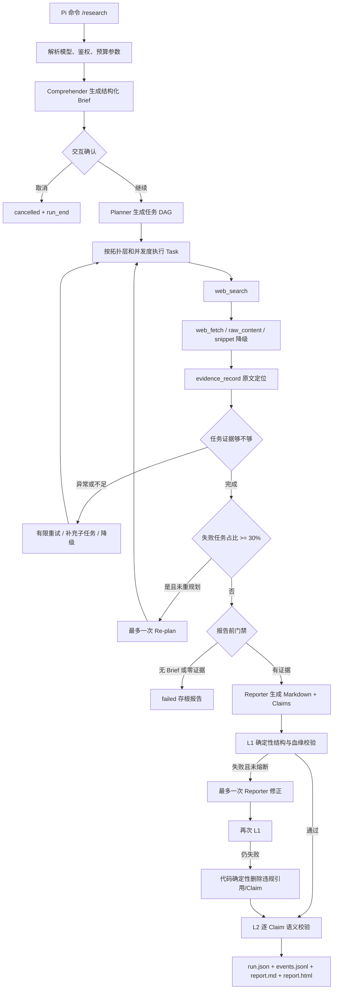
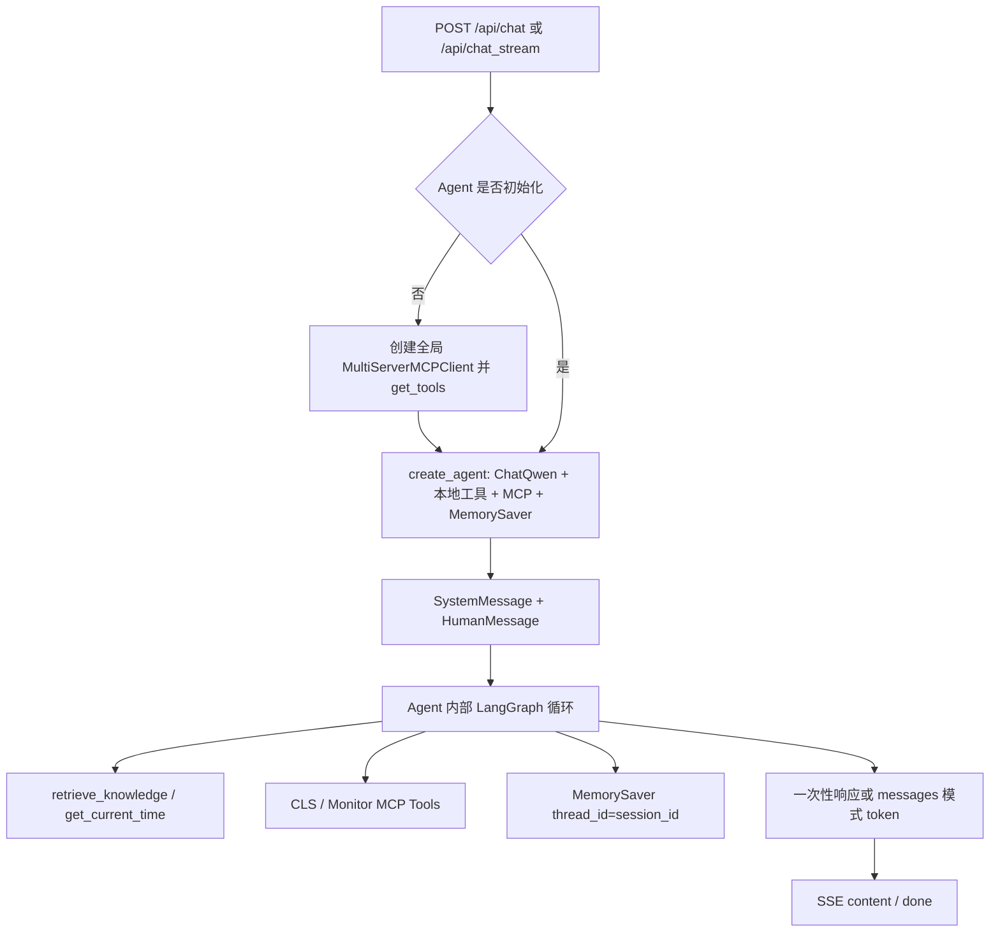
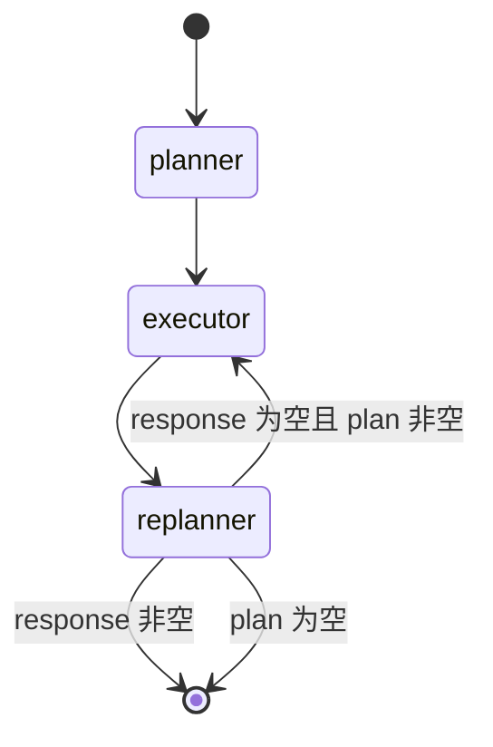

# 现状调研基线：Pi Deep Research 与 SuperBizAgent

> 状态：现状审计草案 v1  
> 审计日期：2026-09-10  
> 本文只回答“现在如何工作”。不包含目标架构定案、迁移排期或代码实现。

## 1. 调研目标与证据边界

本轮调研覆盖：README、依赖声明与锁文件、应用入口、Agent 生命周期、工具调用、上下文与记忆、状态管理、流式输出、MCP、异常恢复、日志、测试、现有运行产物与本机运行状态。

代码目录：

- 项目 A（Pi Deep Research）：`D:\Dev\Projects\pi_search`
- 项目 B（SuperBizAgent）：`D:\Dev\Projects\oncall-agent\super_biz_agent_py-release-2026-03-16`
- 目标项目文档目录：`D:\Dev\Projects\sales-research-agent\docs`

本轮遵守以下证据规则：

1. “代码具备某机制”只说明静态实现存在，不等于线上已经验证。
2. “测试通过”只覆盖测试用例所模拟的边界，不等于真实公网、模型、MCP、Milvus 联调通过。
3. 未读取两个项目的 `.env` 内容，不展示或推断任何密钥。
4. 未启动 FastAPI、MCP、Milvus，也未发起真实公网调研。
5. 项目 B 当前没有可用运行日志；因此无法评价真实错误率、时延、吞吐或稳定性。
6. 项目 A 的真实运行产物只读取聚合字段，不读取用户查询和报告正文。

## 2. 结论摘要

### 2.1 项目 A 的本质

项目 A 不是一个通用聊天 Agent，而是一套嵌入 Pi 的、Evidence-first 的一次性深度调研工作流。其真正有技术含量的部分集中在：

- 结构化 Brief 与研究计划；
- 搜索、抓取、正文降级与缓存；
- 原文摘录定位和证据拒收；
- Claim—Evidence—Source 血缘；
- L1 确定性校验与 L2 模型语义校验；
- 分层失败收敛、预算熔断、事件日志与断点恢复；
- Markdown 与自包含 HTML 溯源报告。

Pi 主要承担命令注册、模型注册表接入、交互确认和进度消息。核心研究模型、网络层、证据层、报告层并不必然只能运行在 Pi 中，但当前接口类型和模型调用仍含 Pi SDK 耦合。

### 2.2 项目 B 的本质

项目 B 是一个 FastAPI 单体应用，组合了三类能力：

- 基于 `create_agent` 的 RAG 聊天；
- 基于 LangGraph `StateGraph` 的 Plan—Execute—Replan AIOps；
- 文档上传、DashScope Embedding、Milvus 检索以及两个本地 MCP 服务。

它已经提供 Python Web 后端、SSE、LangGraph 状态图、MCP 适配和 Milvus 基础设施，但现有业务状态过薄，没有研究证据模型、事实级门禁、可审计事件或持久化恢复。MCP 数据目前明确是模拟数据，不是腾讯云真实日志与监控接入。

### 2.3 当前最关键的五个事实

1. 项目 A 的引用可信机制比“让模型在答案里带 URL”更严格：quote 必须能在落盘正文中定位，否则证据拒收。
2. 项目 A 的 `completed` 只由 L1、任务状态和 Claim 数决定；L2 的 `unsupported/conflicting/uncertain` 不改变终态，也不剔除结论。这与新产品“可信度为硬门槛”并不等价。
3. 项目 A 仅对 `researching` 阶段做同一 run 的增量续跑；其他非终态会调用 `orchestrate()` 从头新建 run，不是完整生命周期恢复。
4. 项目 B 的 `MemorySaver` 仅进程内存有效，重启即丢；现有 `AgentState` / `PlanExecuteState` 无证据、来源、校验、预算和恢复字段。
5. 项目 B 没有测试文件、没有本地虚拟环境、没有运行日志；依赖声明与锁文件元数据发生漂移，当前不能证明环境可复现。

## 3. 仓库与入口现状

### 3.1 项目 A

- Git 分支：`main`
- 审计时提交：`c0a8e47`
- 未跟踪目录：`.codebuddy/`、`.superpowers/`，本轮未改动
- 包名：`@earendil-works/pi-deep-research`
- 版本：`0.84.2`
- Node 要求：`>=22.19.0`
- Pi 实际扩展入口：`src/index.ts`
- 构建产物入口声明：`dist/index.js`
- 测试命令：`npm test` → `vitest --run`

入口 `src/index.ts` 注册：

- `/research`
- `/research:status`
- `/research:list`
- `/research:resume`
- `/research:export`
- `--research-no-confirm`
- `--research-budget-usd`

`/research` 负责解析参数、从 Pi model registry 获取模型与鉴权、可选确认 Brief、发送进度消息并调用 `orchestrate()`。因此它是明显的 Pi 适配层。

### 3.2 项目 B

- Git 分支：`master`
- 审计时提交：`323f98a`
- Python 包目录不是仓库根，而是 `super_biz_agent_py-release-2026-03-16`
- 应用入口：`app/main.py`
- Web 框架：FastAPI
- 默认端口：`9900`
- 静态前端：`static/index.html` + `static/app.js`
- 本地 MCP：`8003`（CLS）与 `8004`（Monitor）
- Milvus：`19530`

FastAPI 生命周期在服务启动时同步连接 Milvus；连接异常没有在 lifespan 内降级处理，因此 Milvus 不可用会阻止整个应用启动，即使请求本身不需要知识库。

应用注册的接口：

| 方法 | 路径 | 当前实现 |
|---|---|---|
| GET | `/` | 返回静态首页 |
| GET | `/health` | Milvus 不通即返回 503 |
| POST | `/api/chat` | 非流式 RAG Agent |
| POST | `/api/chat_stream` | SSE RAG Agent |
| POST | `/api/chat/clear` | 删除内存检查点 |
| GET | `/api/chat/session/{session_id}` | 读取内存检查点历史 |
| POST | `/api/upload` | 仅允许 txt / md，保存后尝试建索引 |
| POST | `/api/index_directory` | 索引目录 |
| POST | `/api/aiops` | SSE Plan—Execute—Replan |

## 4. 项目 A：当前运行链路



### 4.1 Brief 与计划

`ResearchBrief` 包含目标、范围、实体、时间范围、3—7 条成功判据、假设和报告大纲。Planner 生成的每个 Task 必须绑定至少一个判据，并可通过 `dependsOn` 构造 DAG。

Comprehender / Planner 都要求模型通过工具调用返回 TypeBox 结构化结果。模型未调用所需工具时会再提醒一次；单次角色调用默认 90 秒超时。结构约束持续失败时使用最小降级 Brief 或兜底 Task，而不是让异常向上击穿整个 run。

### 4.2 搜索与抓取

当前网络链路为：

1. `web_search` 调用搜索 Provider，默认 Tavily；结果先注册为 snippet 级 Source。
2. 相同查询可命中 run 内缓存。
3. `web_fetch` 先做 URL / DNS / IP / 端口 SSRF 校验。
4. 手动处理重定向，每一跳重新做 SSRF 校验。
5. HTTP 对超时、网络、429、4xx、5xx采取不同的有限重试策略。
6. Provider 连续失败会触发带冷却时间的熔断器。
7. 正文提取顺序为 Readability → plaintext；抓取或解析失败后尝试搜索结果中的 raw content → snippet。
8. 单个 Task 默认最多 5 次 fetch；页面默认分段返回 6000 字符。
9. 页面正文落盘到 `sources/<sourceId>.txt`，Source 保存规范化 URL、内容 hash、抓取策略和正文引用路径。

安全边界已覆盖：非 HTTP(S)、私网/环回/链路本地地址、危险端口、DNS 解析到私网、重定向后变为私网、响应体 5 MB 上限、外部正文的 untrusted-content 包裹与边界转义。

### 4.3 Evidence-first

`evidence_record` 接收 `sourceId + quote + summary + stance`。其中：

- `quote` 必须是原文；
- `summary` 才是模型解释；
- `stance` 为 support / refute / neutral；
- 定位按 exact → normalized → fuzzy 三级执行；
- fuzzy 短引用被禁用；
- 数字不一致时即使文本相似也拒收；
- 成功后记录原文字符区间、匹配等级和相似度；
- 失败证据不增加 Task 的 evidenceCount。

证据是 append-only。Reporter 和 Verifier 不具备联网工具，只能通过 `evidence_query` 查询已收集证据，减少“边写边搜、绕过证据层”的路径。

### 4.4 报告与引用

Reporter 返回 Claims 与 Markdown。脚注定义不信任模型输出：代码先删除模型生成的脚注定义，再按 Evidence 与 Source 重建。

L1 检查：

- 报告是否引用不存在的 Evidence；
- Claim 是否无证据或引用不存在的 Evidence；
- 被引用 quote 是否仍能在正文中定位；
- 成功判据是否能通过 Task → Evidence → Claim 血缘覆盖；
- 正文引用是否有代码生成的脚注；
- 是否存在 fuzzy 证据独撑 Claim（仅告警）；
- 是否存在未使用 Evidence（仅告警）。

L1 失败时最多回灌 Reporter 修正一次；仍失败则按代码规则删除违规句段和相关 Claim。HTML 报告是自包含文件，带引用展开、原文上下文高亮、协议白名单、HTML 转义和 CSP；HTML 导出失败不改变 run 终态。

L2 对每条 Claim 单独调用模型，输入该 Claim 的直接证据、同任务相关证据和反驳证据，输出 supported / unsupported / conflicting / uncertain。调用异常降级为 uncertain，不中断整体。

当前重要缺口：L2 结果只写入“校验结果”章节。终态计算没有读取 L2 verdict；所以 L2 发现 unsupported 或 conflicting 时，run 仍可能是 `completed`。

### 4.5 状态、检查点与恢复

权威快照为 `run.json`，追加事件为 `events.jsonl`。写入顺序是先追加事件、再通过临时文件 + rename 原子覆盖快照。恢复时读取快照并重放 `seq > lastSeq` 的事件。

恢复边界：

- `researching`：复用原 run，running Task 会根据已落盘证据收敛为 success 或 unresolved，pending Task 继续执行；
- `comprehending/planning/reporting/verifying`：不是增量恢复，会重新调用 `orchestrate()`；该函数创建新 runId，因此“从头重跑且幂等”的注释不能等同于同一 run 精确恢复；
- 终态 run：拒绝续跑；
- 崩溃闲置时间会从 wall-clock 预算中扣除。

### 4.6 预算与失败收敛

默认预算：400,000 tokens、2 美元、15 分钟、最多 8 个 Task、每 Task 最多 5 次 fetch。预算在每个 Task 结束后检查，因此属于软上限，单个 Task 可越过上限后才熔断。

失败策略具有硬次数上限：

- 搜索无结果：最多 3 种顺序 Query Rewrite；
- 连续抓取失败：最多一次扩大结果集；
- quote 连续拒收：引导换来源；
- Task 异常：重跑一次；
- 证据不足：补充子任务一次，仍不足可把最小证据数降到 1；
- 失败/未解决 Task 达 30%：全局最多 Re-plan 一次；
- 无 Brief 或零 Evidence：不调用 Reporter，输出 failed 存根；
- 预算熔断：允许基于已有证据结报，但跳过 L1 修正轮与 L2。

### 4.7 项目 A 的实测证据

执行命令：`npm test -- --reporter=dot`

- 测试文件：20 个通过；
- 测试用例：276 个通过；
- 耗时：17.96 秒；
- 备注：276 包含后加的面试学习台测试，并非全部属于研究 Agent。README 中的“260 passing”已落后于当前代码。

现有单次真实 run 聚合：

| 字段 | 值 |
|---|---:|
| 状态 | completed |
| Task | 8 success |
| Source | 116 |
| Evidence | 21 |
| Claim | 20 |
| Recovery | 16，全部为 quote_unverifiable |
| L1 | passed；0 dangling、0 untraceable、0 uncovered |
| L1 告警 | 4 个 fuzzy sole support |
| L2 | 14 supported、5 unsupported、1 uncertain |
| Token | 271,222 / 400,000 |
| 成本字段 | 0.0153852216 / 2 美元 |
| 事件 | 283（lastSeq） |

该样本证明事件、恢复、L1、L2 与导出链路确实被走过，同时也直接暴露“L2 不参与 completed 门禁”的问题。由于只有一个 run，不能据此计算成功率或稳定性。

## 5. 项目 B：当前运行链路

项目 B 有两套 Agent 链路。聊天链路由 LangChain 的 `create_agent` 内部编译为 LangGraph；AIOps 链路则显式构造 `StateGraph`。

### 5.1 RAG 聊天链路



实际特点与限制：

- 每次输入都显式加入 SystemMessage 和 HumanMessage，历史由 MemorySaver 根据 `thread_id` 合并；
- `MemorySaver` 是进程内存，不是持久会话；
- 代码定义了“保留系统消息 + 最近 6 条消息”的 `trim_messages_middleware`，但创建 Agent 时没有传入 middleware，因此当前不会生效；
- Agent 首次请求必须成功执行 MCP `get_tools()`；工具发现失败没有局部降级为“只用本地工具”；
- 非流式使用 `ainvoke()`；
- 流式使用 `astream(..., stream_mode="messages")`，只把 AIMessage / AIMessageChunk 中的 text block 转为 content；
- Service 注释声称会输出 tool_call，但实现没有 yield tool_call 或 search_results；API 和前端为这些事件保留的分支当前没有上游数据；
- 流式异常时 Service 先 yield error 再 raise，API 外层又捕获并 yield error，存在重复错误事件可能；
- `/api/chat` 出错时仍返回 HTTP 200，只在 JSON body 中写 `code: 500`；
- 日志会写完整用户问题，可能泄露售前输入；
- 历史消息没有真实创建时间时，查询接口用“读取当下时间”补 timestamp，并不代表原发送时间。

### 5.2 显式 LangGraph AIOps 链路



状态只有四个字段：

```text
input: str
plan: list[str]
past_steps: append-only list[(step, result)]
response: str
```

节点行为：

- Planner：先尝试检索内部文档，再加载本地与 MCP 工具说明，要求 Qwen 输出结构化 Plan；任意异常返回固定三步兜底计划。
- Executor：一次只取 plan[0]；让模型决定是否调用工具；有工具调用时 ToolNode 执行一次，再让模型总结；异常也会消费该步骤，并把“执行失败”写入 past_steps。
- Replanner：根据执行历史选择 respond / continue / replan；8 步强制结报，执行满 5 步后禁止 replan，新计划不得比剩余计划更长。
- Checkpointer：MemorySaver；按 session_id 保存进程内检查点。
- Streaming：`stream_mode="updates"`，每个节点结束后输出 plan / step_complete / report 等 SSE 事件，不是 token 级报告流。

一个明确的边界错误是：条件函数的注释写“plan 为空但无 response，返回 replanner 生成响应”，实际代码返回 END。因此若 Replanner 返回空 plan 且没写 response，图会结束并发送 response 为空的 complete。

### 5.3 RAG 与文档链路

当前上传只接受 `.txt` 和 `.md`，最大 10 MB，不支持 PDF 或网页。

Markdown 分块过程：按 H1/H2 切分 → 递归字符分割 → 合并小于 300 字符的片段。配置中的 `chunk_max_size=800` 实际二次分块使用 `1600`，overlap 为 100。

Embedding 通过 OpenAI 兼容接口调用 DashScope `text-embedding-v4`，固定 1024 维。全局 `vector_embedding_service` 在模块导入时创建；若 API Key 缺失会直接抛 ValueError，因此配置错误可能在应用导入阶段发生，而不是请求阶段。

Milvus 使用 L2 距离，知识工具通过 LangChain vector store retriever 取 top 3。知识工具捕获异常并返回一段错误文本；模型可能把该错误文本当作普通工具结果继续处理。

文件先落盘再建索引；索引失败只记日志，上传接口仍返回 success。文件覆盖是先删除旧文件、再写新文件，且没有把“旧索引如何删除/更新”作为事务的一部分。

### 5.4 MCP 现状

MCP Client 是全局延迟单例，配置两个 streamable-http server。工具调用拦截器最多尝试 3 次，等待 1 秒、2 秒；全部失败后返回 `isError=True` 的 CallToolResult，而不是抛异常。

需要区分两种失败：

- 工具已经发现，单次调用失败：拦截器可重试并软失败；
- MCP 服务不可达，`get_tools()` 发现工具失败：当前 Agent 初始化、Planner 或 Executor 可能直接进入各自异常路径，拦截器并不能保证工具发现成功。

两个 MCP Server 的数据都是 mock：

- CLS 内置地区、topic，并按时间范围生成固定 INFO 日志；
- Monitor 使用固定场景和 `random.uniform()` 生成监控序列；
- MCP README 明确写“当前版本返回模拟数据，生产环境需配置真实 API”。

因此 README 中“腾讯云 CLS 日志查询和监控数据工具接入”只能理解为协议与工具形态演示，不能理解为已完成真实云 API 集成。

### 5.5 日志与观测

Loguru 配置：控制台输出 + `logs/app_YYYY-MM-DD.log`，每日轮转、保留 7 天、过期 zip、异步写入。

现有问题：

- 本机仓库内没有 `logs/`、MCP log 或其他 `.log` 文件；
- 没有 trace_id / run_id 统一贯穿 API、Graph、Tool 与外部调用；
- 没有结构化 token、成本、阶段耗时、重试次数或事实覆盖率指标；
- `diagnose=True` 在文件 sink 中恒为 true，异常日志可能包含局部变量；
- 多处记录完整输入、工具参数或问题文本；
- 无 LangSmith 或其他 tracing/eval 接入代码。

本机检查时，9900、8003、8004、19530、9091 均无监听进程，也未发现对应服务进程。因此本轮没有“线上日志”可分析。

### 5.6 依赖与可复现性

`pyproject.toml` 声明 Python `>=3.11,<3.14`，但 README 徽章与正文写 Python 3.10+，两者不一致。

更关键的是声明与锁文件漂移：

| 包 | pyproject 当前声明 | uv.lock 当前解析 |
|---|---:|---:|
| FastAPI | 0.109.0 | 0.128.8 |
| LangChain | 0.1.0 | 1.2.10 |
| langchain-core | 0.1.0 | 1.2.11 |
| langchain-openai | 1.0.0 | 1.1.9 |
| LangGraph | 0.0.40 | 1.0.8 |
| Pydantic | 2.5.0 | 2.12.5 |
| pymilvus | 2.3.5 | 2.6.9 |

锁文件中项目 metadata 仍记录旧的 `>=` 约束，而当前 `pyproject.toml` 多处已经改成 `==`。因此该锁文件不是当前依赖声明的可信快照。

本轮执行 `uv lock --check` 时还因当前 uv 默认缓存位于受限 C 盘而无法初始化缓存。按照本机规则不能擅自迁移全局缓存；所以没有改配置或重新锁定依赖。

### 5.7 测试现状

- `pyproject.toml` 配置了 pytest、coverage、ruff、mypy、pyright；
- Makefile 也定义了 test / lint / typecheck 命令；
- 实际仓库没有 `tests/`，匹配到的测试文件数量为 0；
- 当前没有 `.venv`；
- 对 39 个 Python 文件执行了 UTF-8 读取与 `ast.parse`，语法全部通过；
- 未安装依赖并运行 pytest，因为不存在测试，且重建环境会改变本地状态；
- 未做 import smoke test，因导入会加载 `.env`、初始化全局 Embedding 对象并可能产生文件日志。

“语法通过”不能替代依赖安装、应用导入、启动、API、SSE、MCP 或 Milvus 集成测试。

## 6. 两个项目当前能力边界对照（非迁移建议）

| 维度 | 项目 A 当前实现 | 项目 B 当前实现 |
|---|---|---|
| 产品形态 | Pi 命令式单用户调研扩展 | FastAPI + 静态 Web 的聊天/AIOps 单体 |
| 主编排 | 自研 TypeScript orchestrator | LangChain create_agent + 显式 LangGraph |
| 研究状态 | Brief、Task DAG、Source、Evidence、Claim、Verification、Budget、Recovery | messages 或 input/plan/past_steps/response |
| 工具 | search、fetch、evidence record/query | knowledge、time、MCP mock tools |
| 外部事实证据 | 原文 quote + locator + source + hash | 工具文本直接进入模型，无事实对象 |
| 引用门禁 | L1 确定性检查；L2 不阻断终态 | 无 |
| 网页采集 | 搜索 + HTML 抓取 + 多级降级 | 无公网调研工具 |
| PDF | 无 | 无；上传也不接受 PDF |
| 恢复 | JSON 快照 + JSONL 事件；研究阶段可续跑 | MemorySaver，仅进程内 |
| 失败控制 | 分层、有限次数、预算与熔断 | MCP 工具重试；节点异常多数转错误文本 |
| 流式 | Pi 进度消息，不是 token SSE | SSE；聊天 token、AIOps 节点更新 |
| MCP | 无 | Client + 两个 mock Server |
| 输出 | Markdown + 自包含 HTML | 聊天文本 / AIOps Markdown |
| 观测 | 事件流、trace 渲染、预算、恢复记录 | Loguru 文本日志 |
| 自动测试 | 276 通过（含非研究模块） | 0 个测试；仅完成 AST 检查 |

## 7. README 与代码漂移清单

### 项目 A

- README 写 260 tests，当前实测 276。
- README 示例 runId 与本地真实 runId 不同，属于文档示例，不应当作当前运行证据。
- README 容易让人理解为完整断点续跑；代码只完整覆盖 researching 阶段。
- README 强调语义校验，但当前 L2 verdict 不参与 completed 判定。

### 项目 B

- README 写 Python 3.10+，pyproject 要求 3.11—3.13。
- README 将依赖描述为 latest 或 0.109+，pyproject 使用精确 pin，uv.lock 又解析为更高版本。
- README 描述日志目录，但当前仓库没有日志。
- README 的 MCP 描述像真实日志/监控接入；代码和 MCP README 明确是 mock。
- README 对 `rag_agent_service.py` 标注“LangGraph 状态图”，代码实际调用 LangChain `create_agent`，图由框架内部构造，不是业务显式 StateGraph。
- SSE API 文档承诺 tool_call 事件，Service 当前只发 content / complete / error。
- README 的目录结构基本存在，但“已配置并能一键运行”尚无本机运行证据。

## 8. 已有约束

### 8.1 产品约束（此前已确认）

- 核心用户先聚焦售前工程师本人；
- 首期只做公网调研，不做企业内部资料接入；
- 不保留通用聊天与 AIOps 产品能力；
- 可信度是硬门槛，效率为第二目标；
- 所有外部事实必须有证据；
- 允许研究空白和不确定结论，不允许无证据事实进入可交付正文；
- 完整调研 30 分钟内可接受；
- 输出以浏览器 HTML 阅读为主，同时导出 Markdown；
- 固定核心章节 + 按场景加载条件模块；
- PDF 倾向 MinerU，网页解析选型尚未冻结。

### 8.2 工程与环境约束

- 只做调研与设计，不修改 A、B 代码；
- 新项目和开发数据应留在 `D:\Dev\Projects`，不迁移到 C 盘；
- 中文 UTF-8，不允许乱码；
- 不改用户全局 Git safe.directory；本轮用单次 `-c safe.directory=...` 做只读检查；
- 两个 Git 仓库所有者 SID 与当前用户不同；
- 现有正确功能应保留，未来改动必须先理解旧逻辑；
- 项目 A 的 `.codebuddy/` 等未跟踪数据视为用户资产。

## 9. 当前无法下结论的事项

以下信息缺失，不能猜测：

1. 项目 B 在一套干净环境中是否能按当前 pyproject + uv.lock 安装成功。
2. 项目 B 在当前 `.env` 下能否 import、连接 DashScope、Milvus 与 MCP 并完整启动。
3. 两个 Agent 对同一真实售前问题的质量、耗时、成本对比。
4. Tavily 在目标网络环境下的覆盖、限流与失败率。
5. HTML 动态站、反爬站、登录站、JS 渲染站的真实抓取成功率。
6. MinerU 的具体部署模式、硬件成本、吞吐和 PDF 类型覆盖。
7. 项目 A 的成本统计是否对全部模型 Provider 准确；本轮只看到聚合字段，没有独立账单核对。
8. 项目 A 的单个真实 run 是否来自稳定版本、是否人工干预、报告是否被人工认为可用。
9. 项目 B 所谓“线上日志”所在环境和访问方式；当前本机没有这些日志。

## 10. 对下一步讨论的输入

在进入“能力迁移与目标架构”前，最小需要补齐的不是更多功能想法，而是三组基线：

1. 一组固定的售前公网调研样题与人工评分标准；
2. 项目 A 对这些样题的真实报告、事件和成本数据；
3. 项目 B 的可复现依赖基线与最小启动/测试证据。

如果暂时不想运行真实模型，下一步也可以先基于本审计做“能力对照表与迁移边界”，但其中所有运行质量结论必须继续标为待验证。

## 11. 主要代码证据索引

### 项目 A

- `src/index.ts`：Pi 扩展入口与命令
- `src/types.ts`：完整研究领域模型与事件模型
- `src/orchestrator/run.ts`：生命周期、报告门禁、L1/L2、终态与恢复
- `src/orchestrator/checkpoint.ts`：快照、事件与正文落盘
- `src/orchestrator/replay.ts`：事件重放
- `src/orchestrator/failure-policy.ts`：Task / Run 级恢复
- `src/orchestrator/budget.ts`：预算熔断与 reporting gate
- `src/net/http.ts`、`src/net/ssrf-guard.ts`：网络重试、熔断与 SSRF
- `src/tools/web-search.ts`、`web-fetch.ts`：搜索与抓取
- `src/tools/evidence-record.ts`、`evidence-query.ts`：证据写入与查询
- `src/verify/quote-locator.ts`：三级 quote 定位
- `src/roles/verifier-l1.ts`、`verifier-l2.ts`：两级校验
- `src/report/markdown.ts`、`html.ts`：报告渲染与安全输出
- `src/observability/trace.ts`：运行 trace 展示
- `test/`：自动测试

### 项目 B

- `app/main.py`：FastAPI 入口与 Milvus 生命周期
- `app/config.py`：配置与 MCP server 列表
- `app/services/rag_agent_service.py`：聊天 Agent、MemorySaver 与 token 流
- `app/services/aiops_service.py`：显式 LangGraph 与节点事件流
- `app/agent/aiops/planner.py`、`executor.py`、`replanner.py`：三个图节点
- `app/agent/aiops/state.py`：PlanExecuteState
- `app/agent/mcp_client.py`：MCP Client 与工具重试
- `mcp_servers/cls_server.py`、`monitor_server.py`：模拟 MCP 工具
- `app/services/vector_*`、`document_splitter_service.py`：RAG 基础设施
- `app/api/chat.py`、`aiops.py`、`file.py`、`health.py`：API 与 SSE
- `app/utils/logger.py`：Loguru 配置
- `static/app.js`：浏览器端 SSE 消费
- `pyproject.toml`、`uv.lock`：依赖声明与锁文件

