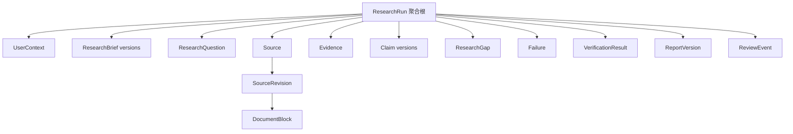

# 领域模型与 LangGraph 节点契约

> 状态：详细设计初稿完成，等待用户最终评审  
> 本文是字段与节点级详细设计，不代表代码已经实现。  
> 上位文档：`product-and-architecture-decisions.md`、`current-state-audit.md`、`capability-migration-and-target-architecture.md`

## 1. 已确认的建模方案

采用规范化领域模型：

- Graph State 只保存实体 ID、执行状态、计数器和路由字段；
- SQLite 保存 Source、Evidence、Claim 等结构化领域数据；
- 本地 artifact store 保存网页、PDF、解析文本和报告导出物；
- LangGraph checkpointer 保存图的执行位置、pending writes 和 interrupt；
- 不把所有对象嵌入 Graph State，也不把一次运行保存成无法局部更新的大 JSON；
- 后续多人服务化时，通过 repository 接口把 SQLite/本地文件替换为 PostgreSQL/对象存储。

## 2. 聚合边界与数据所有权



数据所有权规则：

- `ResearchRun` 管理生命周期、预算、当前阶段和实体索引，不嵌套保存全部正文；
- Source 代表逻辑来源，SourceRevision 代表某次获取到的不可变内容版本；
- DocumentBlock 是可以回到网页或 PDF 原件位置的解析文本单元；
- Evidence 通过校验后不可修改，纠错必须创建新 Evidence；
- Claim 使用稳定 `claim_id`，实质变化创建新的 `claim_version`；
- VerificationResult 绑定对象的具体版本，内容变化后旧验证自动失效；
- ReportVersion 保存当时采用的 Claim、Gap、验证结果和导出物快照；
- ReviewEvent 只追加，不直接覆盖 Claim 或 Evidence；
- Graph checkpoint、领域库与 artifact store 各自有独立职责，不能互相替代。

## 3. 状态轴

### 3.1 执行状态

```text
CREATED
RUNNING
INTERRUPTED
CANCELLED
FINISHED
```

- 用户在尚未形成报告时取消：`execution_status=CANCELLED`，`report_outcome` 为空；
- 用户选择提前停止扩展研究并基于已有证据结报：不是 CANCELLED，流程继续验证并计算报告结果。

### 3.2 报告结果

```text
COMPLETED
PARTIAL
NEEDS_REVIEW
FAILED
```

- `COMPLETED`：必需问题达到完成规则；全部事实 Claim 通过结构和语义支持；不存在未裁决高影响冲突；报告验证通过；
- `PARTIAL`：存在可信可用 Claim，但部分必需问题因公开资料、预算或工具失败未完成，且缺口完整披露；
- `NEEDS_REVIEW`：存在不能自动裁决的高影响冲突、Evidence 定位/语义歧义或关键时效问题；
- `FAILED`：无法形成任何可信可用报告、核心状态无法安全恢复，或关键系统错误阻止流程继续。

`PARTIAL` 与 `COMPLETED` 使用同一事实可信门槛。人工审阅进度与 `report_outcome` 分离，用户尚未阅读不等于 `NEEDS_REVIEW`。

### 3.3 ResearchQuestion 状态

```text
PLANNED
RESEARCHING
ANSWERED
PARTIALLY_ANSWERED
UNANSWERED
BLOCKED
```

### 3.4 Claim 支持状态

```text
SUPPORTED
PARTIALLY_SUPPORTED
DISPUTED
INSUFFICIENT
REJECTED
```

`PARTIALLY_SUPPORTED` 的复合事实应优先拆分或缩窄到已支持范围；无法缩窄时只能进入限制/待验证部分。`DISPUTED` 和 `INSUFFICIENT` 的外部事实不得以确定语气进入正式报告正文。

## 4. 核心领域实体

字段列表是逻辑 Schema。实现时使用 Pydantic v2，并为持久化模型单独定义映射，避免 ORM 类型渗透到领域层。

### 4.1 ResearchRun

```text
run_id
schema_version
execution_status
report_outcome?
current_phase
as_of_date
brief_id?
active_report_version_id?
budget
created_at
updated_at
finished_at?
terminal_reason?
```

### 4.2 UserContext

```text
user_context_id
run_id
customer_name?
meeting_topic?
known_requirements[]
background_notes[]
source_type
sensitivity_level
external_use_policy
created_at
```

UserContext 可以指导问题规划，但默认不能成为公网 Evidence。敏感内容不得原样进入外部搜索或发送给不需要它的第三方服务。

### 4.3 ResearchBrief

```text
brief_id
run_id
version
goal
included_scope[]
excluded_scope[]
scenario_profile
enabled_module_ids[]
assumptions[]
completion_policy
user_context_id
confirmed_at?
created_at
```

Brief 修订创建新版本，不覆盖已确认版本。用户和模型都不能关闭可信规则、固定报告核心或风险披露。

### 4.4 ResearchQuestion

```text
question_id
run_id
brief_version
text
rationale
importance: HIGH | MEDIUM | LOW
required: bool
status
depends_on[]
source_requirements
freshness_requirement?
search_budget
evidence_count
attempt_count
created_at
updated_at
```

### 4.5 Source

```text
source_id
canonical_url
source_type: WEB | PDF
domain
tier
discovered_by
created_at
```

### 4.6 SourceRevision

```text
source_revision_id
source_id
final_url
title
published_at?
event_time?
retrieved_at
content_hash
media_type
artifact_id
parser_name
parser_version
extraction_method
freshness_status
quality_status
```

同一 URL 内容发生变化时新增 Revision，不能覆盖旧内容，否则旧 Evidence 的原文定位会失效。

### 4.7 DocumentBlock

```text
block_id
source_revision_id
ordinal
text_artifact_ref
heading_path[]
page_number?
bbox?
dom_locator?
char_start
char_end
extraction_method
```

PDF Block 尽量保存页码和 bbox；网页 Block 保存标题路径、字符区间和必要 DOM 定位。

### 4.8 Evidence

```text
evidence_id
run_id
question_id
source_revision_id
block_id
quote
quote_hash
locator
summary
stance: SUPPORT | REFUTE | NEUTRAL
match_level: EXACT | NORMALIZED | FUZZY
match_score?
extracted_numbers[]
validation_status
created_at
```

Evidence 不变量：

- 必须绑定具体 SourceRevision 和 DocumentBlock；
- quote 与模型 summary 严格分离；
- 必须通过原文定位、数字一致性、来源接纳、时效和解析质量检查才能 APPROVED；
- FUZZY Evidence 不能单独支撑高影响事实；
- 搜索摘要默认只能作为线索，不能直接成为正式 Evidence；
- Evidence 不可更新，纠错通过新建记录并废止旧记录完成。

### 4.9 Claim

```text
claim_id
claim_version
run_id
question_ids[]
claim_type: FACT | INFERENCE | RECOMMENDATION
text
impact_level: HIGH | MEDIUM | LOW
evidence_ids[]
upstream_claim_refs[]
support_status
freshness_status
limitations[]
valid_from?
valid_until?
supersedes_version?
created_at
```

Claim 血缘：

- Fact 必须直接绑定 APPROVED Evidence；
- Inference 必须绑定上游 Fact Claim，可以附加 Evidence；
- Recommendation 必须绑定支撑它的 Fact/Inference 和适用条件；
- 内容、关键 Evidence 或支持状态变化时必须创建新版本。

### 4.10 VerificationResult

```text
verification_id
target_type
target_id
target_version
verification_type
verifier
verdict
reasons[]
evidence_ids[]
rule_version
prompt_version?
model_id?
created_at
```

验证分四层：Evidence 定位与数字一致性、Claim 结构/血缘/时效、Claim 语义支持与冲突、Report 引用/状态/双格式一致性。

### 4.11 ResearchGap

```text
gap_id
question_id
gap_type
description
impact_level
attempted_queries[]
failed_source_ids[]
failure_ids[]
suggested_follow_up
disclosed_in_report
created_at
```

### 4.12 Failure

```text
failure_id
run_id
scope_type
scope_id
category
retryable
attempt
strategy
outcome
safe_message
technical_detail_ref?
created_at
```

### 4.13 ReportVersion

```text
report_version_id
run_id
version_number
lifecycle_status: DRAFT | VALIDATED | ACTIVE | REJECTED
report_outcome?
brief_version
claim_refs[]
gap_ids[]
verification_ids[]
markdown_artifact_id?
html_artifact_id?
generated_at
supersedes_version?
```

ReportVersion 不可覆盖。DRAFT 允许双格式尚未全部生成；只有 HTML 和 Markdown 从同一个不可变 ReportModel 编译并通过一致性验证后才能进入 VALIDATED/ACTIVE。

### 4.14 ReviewEvent

```text
review_event_id
run_id
report_version_id
target_type
target_id
target_version
decision: ACCEPT | VERIFY_LATER | REJECT
comment?
actor
inherited_from_version?
created_at
```

审阅状态由事件计算。只有 Claim 内容、关键 Evidence 和支持状态均未变化时，才能继承旧版本审阅结果。

## 5. Graph State

```text
ResearchState
  schema_version
  run_id
  thread_id
  execution_status
  report_outcome?
  current_phase
  brief_id
  user_context_id
  research_question_ids[]
  active_question_ids[]
  source_ids[]
  evidence_ids[]
  claim_ids[]
  gap_ids[]
  failure_ids[]
  verification_result_ids[]
  report_version_id?
  budget_snapshot
  retry_counters
  supplement_round
  pending_review_ids[]
  terminal_reason?
  updated_at
```

Graph State 不保存完整网页、PDF、解析正文、整份报告或无限增长的消息历史。

并行列表字段不能简单使用 `operator.add`，否则节点重试会产生重复 ID。实现时使用稳定 ID 去重 reducer，或让节点先幂等写领域库，再向 State 合并唯一 ID。

## 6. 节点通用契约

每个节点必须明确：

- 输入 State 字段和需要读取的领域实体；
- 输出 State 更新和新建领域实体 ID；
- 是否调用模型、Provider、文件系统或数据库；
- 超时、可重试错误和最大尝试次数；
- 可能产生的 Failure；
- 条件路由；
- 幂等键和恢复后重放行为；
- 开始、成功、失败、重试和路由审计事件。

统一幂等键基础形式：

```text
run_id + node_name + stable_input_version_hash
```

外部调用额外记录 Provider、operation、request fingerprint 和 attempt，避免恢复后无限重复收费。

## 7. 入口、Brief 与规划节点

| 节点 | 输入 | 输出 | 外部副作用 | 失败与重试 | 下一步 |
|---|---|---|---|---|---|
| `create_run` | 创建请求、UserContext | run_id、初始预算、RUNNING | 创建 Run、UserContext、审计事件 | 数据库失败最多重试 1 次 | `build_brief` |
| `build_brief` | UserContext、场景配置、目标 | ResearchBriefCandidate | 结构化模型调用 | Schema 失败修正 1 次；之后安全兜底或 FAILED | `validate_brief` |
| `validate_brief` | BriefCandidate、产品硬约束 | 已验证 Brief 或错误清单 | 保存 BriefVersion | 纯代码；可信规则不可关闭 | `confirm_brief` 或 FAILED |
| `confirm_brief` | Brief、确认摘要 | 接受、修改或取消 | `interrupt()`、checkpoint | 不自动超时；相同 thread_id 恢复 | `apply_brief_decision` |
| `apply_brief_decision` | 用户决策、BriefVersion | 新 BriefVersion 或取消状态 | 保存审阅事件 | 修改后重新确定性校验 | 规划、再次确认或 CANCELLED |
| `plan_research_questions` | 已确认 Brief、场景模块、预算 | QuestionCandidate[] | 结构化模型调用、保存 Question | Schema/覆盖失败修正 1 次；代码补最小问题 | `validate_plan` |
| `validate_plan` | Questions、Brief | 已验证问题 DAG | 保存验证结果 | 检查重复、未知依赖、循环和预算 | `dispatch_questions` 或 FAILED |
| `dispatch_questions` | 可执行问题、预算 | 多个子图输入 | 通过 `Send` 分发 | 只分发依赖满足且未完成的问题 | Question 子图 |

约束：

- Planner 只生成研究问题，不直接生成搜索结果、Evidence 或 Claim；
- Question ID 由系统分配，不能信任模型 ID；
- 恢复时不重复创建或分发已经完成的问题；
- Brief 确认是唯一默认强制人工暂停点。

## 8. Research Question 子图节点

| 节点 | 输入 | 输出 | 外部副作用 | 失败与重试 | 下一步 |
|---|---|---|---|---|---|
| `initialize_question` | Question、Brief 摘要、预算切片 | QuestionExecutionContext | 标记 RESEARCHING | 纯代码，重复执行返回已有上下文 | `generate_queries` |
| `generate_queries` | Question、已尝试查询、Gap | SearchQueryCandidate[] | 结构化模型调用 | Schema 修正 1 次；轮次有上限 | `validate_queries` |
| `validate_queries` | 查询候选、外发规则 | ApprovedSearchQuery[] | 保存查询和审计 | 脱敏、去重、范围校验；全无效则 BLOCKED | `execute_searches` |
| `execute_searches` | ApprovedSearchQuery[] | SearchResult[] | 调用 Provider、写缓存 | timeout/network/429 有限重试 | `rank_sources` |
| `rank_sources` | SearchResult[]、已有 Source | RankedSourceCandidate[] | 注册来源发现 | 纯代码去重 | `select_sources` |
| `select_sources` | 候选、问题要求、预算 | SourceCandidate[] | 可调用结构化模型 | 模型失败按确定性规则降级 | `acquire_sources` |
| `acquire_sources` | SourceCandidate[] | SourceRevision 或 Failure | 下载并保存原件 | 每来源有限重试；安全/4xx 不重试 | `parse_sources` |
| `parse_sources` | SourceRevision、artifact | DocumentBlock[]、ParseQuality | 保存文本、定位和解析器信息 | 静态→动态；PDF 主→降级；有硬上限 | `extract_evidence_candidates` |
| `extract_evidence_candidates` | Question、DocumentBlock | EvidenceCandidate[] | 结构化模型调用 | Schema 修正 1 次 | `verify_evidence` |
| `verify_evidence` | Candidate、SourceRevision、Block | Evidence[]、Rejected[] | 追加 Evidence、保存验证结果 | 纯代码 | `evaluate_question` |
| `evaluate_question` | Question、Evidence、Failure、预算 | QuestionAssessment | 保存覆盖评估 | 不能只按 Evidence 数量完成 | `route_question` |
| `route_question` | Assessment、候选、预算 | 路由决策 | 保存路由事件 | 每种恢复路径有硬计数 | 完成、继续、改写或 Gap |
| `finalize_question` | Assessment、Evidence、Failure | 最终问题状态 | 更新 Question、创建 Gap | 失败与未覆盖项必须披露 | 返回父图 |

### 8.1 网页降级链

```text
URL 安全检查
→ HTTPX 静态获取
→ 保存原始 HTML
→ Trafilatura 正文抽取
→ 质量检查
→ 必要时 Playwright 动态渲染
→ 仍不合格则 Failure
```

### 8.2 PDF 候选降级链

```text
保存原始 PDF
→ MinerU 主解析候选
→ PyMuPDF 页数、文本和定位校验
→ 必要时 OCR/替代解析
→ 仍不合格则记录解析质量 Failure；只有关键问题依赖该歧义内容时，父图才可能判 NEEDS_REVIEW
```

具体 backend 必须由 PoC 决定，节点契约不随解析器变化。

### 8.3 EvidenceCandidate 最小输出

```text
source_revision_id
block_id
quote
summary
stance
relevance_to_question
candidate_time_context
```

模型不能设置 Evidence 为 APPROVED。系统 validator 负责定位、数字、来源、时效、解析质量和重复检查。

### 8.4 问题停止条件

完成判断至少考虑：子方面覆盖、来源要求、高影响事实是否由低等级/fuzzy 证据独撑、反驳证据、预算和新一轮检索的边际收益。

```text
达到完成规则
→ ANSWERED

部分回答但来源或预算耗尽
→ PARTIALLY_ANSWERED + ResearchGap

没有有效 Evidence 且已合理穷尽
→ UNANSWERED + ResearchGap

安全、登录、付费墙、验证码或关键解析阻断
→ BLOCKED + Failure/ResearchGap

仍有明确补证据路径且预算允许
→ 继续下一个来源或查询轮次
```

同一问题 Query Rewrite 默认最多 3 轮，来源扩展默认最多 1 轮；最终数值可配置，但模型不能自行提高。

## 9. Claim、冲突与报告节点

| 节点 | 输入 | 输出 | 外部副作用 | 失败与重试 | 下一步 |
|---|---|---|---|---|---|
| `aggregate_research` | 问题状态、Evidence、Gap | ResearchCoverageSnapshot | 保存覆盖快照 | 纯代码；缺失分支不得默认成功 | `route_research_coverage` |
| `route_research_coverage` | 覆盖、预算、失败 | 补研、结报或失败决策 | 保存路由事件 | 补研轮次有硬上限 | 补研或 Claim 综合 |
| `plan_supplement` | Gap、现有 Evidence | 增量 Question[] | 结构化模型调用、保存问题 | 仅针对明确缺口，默认最多 1 轮 | Question 子图 |
| `synthesize_claims` | Approved Evidence、Brief、问题结果 | ClaimCandidate[] | 结构化模型调用 | Schema 修正 1 次 | `validate_claim_lineage` |
| `validate_claim_lineage` | Claims、Evidence | 合法 Claim 或错误 | 保存 L1 验证结果 | 纯代码 | `semantic_verify_claims` |
| `semantic_verify_claims` | Claim、支持和反驳 Evidence | ClaimSupportResult[] | 调用验证模型 | 单 Claim 失败为 UNCERTAIN，不击穿批次 | `resolve_claims` |
| `resolve_claims` | Claim、支持结果、影响等级 | Approved/Rejected/Disputed | 创建 ClaimVersion、验证记录 | 定向修订最多 1 次 | 报告、修订或人工处理 |
| `record_conflict_review_requirement` | 高影响争议 Claim | pending_review_ids | 保存冲突与待审阅项 | 不自动裁决、不等待用户阻塞主 run | `build_report_model`，最终 NEEDS_REVIEW |
| `build_report_model` | Approved Claim、Gap、Failure、状态 | 不可变 ReportModel | 保存 ReportVersion 草稿 | 纯代码；不访问原始网页 | `compile_reports` |
| `compile_reports` | ReportModel | Markdown/HTML artifact | 原子写文件 | 单格式失败不能伪装双格式成功 | `verify_reports` |
| `verify_reports` | ReportModel、导出物 | ReportVerificationResult | 保存验证结果 | 纯代码 | 修复或终态计算 |
| `repair_report` | 确定性错误清单 | 修复后的导出物 | 创建新草稿 artifact | 只修格式/引用，不增加事实 | 再验证 1 次 |
| `compute_outcome` | 全部验证、Question、Gap、冲突 | report_outcome | 更新 Run | 唯一报告结果计算入口 | `finalize_run` |
| `finalize_run` | outcome、ReportVersion | FINISHED | 提交版本和完成事件 | 可幂等重试 | END |

Claim 生成规则：

- 每条 Claim 单独验证；
- Fact 只能从 Evidence 生成；
- Inference 只能从已验证 Fact 推导；
- Recommendation 绑定上游 Claim 和适用条件；
- Claim ID 由系统分配；
- Report compiler 只能使用 approved Claim，不能根据 Source 正文补写事实；
- 执行摘要只能引用正文已有 Claim。

冲突路由：

```text
低影响或可明确判伪
→ 排除错误 Claim，保留验证记录

证据不足
→ INSUFFICIENT，进入 Gap 或待验证部分

支持与反驳证据并存但不影响核心判断
→ DISPUTED，只能进入风险/冲突章节

高影响且系统无法裁决
→ NEEDS_REVIEW，不得 COMPLETED

Claim 表述错误但 Evidence 充分
→ 最多定向修订一次，再重新验证
```

## 10. 人工审阅、局部补研与版本继承节点

首次调研 Graph 和报告审阅/补研 Graph 分开。首次 Graph 到达 END 后，不使用 `Command(resume)` 强行重新进入；补研在同一个 `run_id` 下创建新的 `revision_operation_id` 和 graph thread：

```text
首次调研 thread: <run_id>:initial
补研 thread:     <run_id>:revision:<number>
报告版本:        v1 → v2
```

`Command(resume=...)` 只用于仍处于 interrupt 的 Brief 确认。高影响冲突不让主 run 无限等待：系统生成带冲突披露的 NEEDS_REVIEW 报告并结束首次 Graph，之后通过独立审阅/补研 Graph 处理。

### 10.1 审阅节点

| 节点 | 输入 | 输出 | 副作用 | 失败处理 | 下一步 |
|---|---|---|---|---|---|
| `load_review_context` | run_id、report_version_id | Report/Claim/Review 快照 | 无 | 版本不存在 404；旧版本允许只读 | `validate_review_action` |
| `validate_review_action` | target、decision、comment | ValidatedReviewCommand | 无 | 检查对象版本和并发修改 | `record_review_event` |
| `record_review_event` | ValidatedReviewCommand | review_event_id | 追加 ReviewEvent | command_id 幂等 | 继承计算或驳回传播 |
| `propagate_rejection` | 被驳回 ClaimVersion | InvalidatedClaimRef[] | 追加失效关系和审计事件 | 纯代码依赖图遍历 | `build_review_snapshot` |
| `build_review_snapshot` | 当前版本 ReviewEvent | ReviewProgress | 保存可重算快照 | 纯代码 | END |

审阅决策不修改 Claim：

- `ACCEPT`：用户认可该版本 Claim 可用于售前准备；
- `VERIFY_LATER`：允许保留，但不得显示为人工确认；
- `REJECT`：从下一正式报告版本排除，并使依赖它的推断和建议重新验证。

同一用户动作必须携带 `command_id`，浏览器重试不能写入重复事件。

### 10.2 驳回传播

```text
Fact Claim 被驳回
→ 该版本退出下一份报告
→ 依赖它的 Inference 重新验证
→ 依赖该 Inference 的 Recommendation 重新验证
→ 原 Claim、Evidence、理由和 ReviewEvent 永久保留
```

传播结果只能是保持有效、需要重新验证或因失去必要上游依据而失效。系统不能删除 Evidence，也不能自动把其他 Claim 标记为用户认可。

### 10.3 局部补研节点

| 节点 | 输入 | 输出 | 副作用 | 失败处理 | 下一步 |
|---|---|---|---|---|---|
| `create_revision_operation` | run_id、base version、target | revision_operation_id | 创建新 graph thread 和预算 | 基础版本必须存在 | `define_supplement_scope` |
| `define_supplement_scope` | Claim/Gap、用户说明、旧证据 | SupplementBrief | 保存补研范围 | 不允许悄悄扩大为全量重跑 | `plan_supplement_questions` |
| `plan_supplement_questions` | SupplementBrief | 增量 Question[] | 结构化模型调用、保存问题 | Schema 修正 1 次 | Question 子图 |
| `merge_new_evidence` | 新 Evidence ID[] | UpdatedEvidencePoolRef | 只追加，不覆盖旧证据 | 稳定 ID 去重 | `compute_affected_claims` |
| `compute_affected_claims` | 目标、依赖图、新 Evidence | AffectedClaimRef[] | 保存影响范围 | 纯代码 | `revise_affected_claims` |
| `revise_affected_claims` | 受影响 Claim、旧新 Evidence | 新 ClaimVersion[] | 结构化模型调用 | 每 Claim 修订 1 次 | `reverify_affected_claims` |
| `reverify_affected_claims` | 新 ClaimVersion、Evidence | VerificationResult[] | 保存新验证 | 单 Claim 失败为 UNCERTAIN | `inherit_review_decisions` |
| `inherit_review_decisions` | v1/v2 diff、旧 ReviewEvent | 继承或失效结果 | 追加继承审计事件 | 纯代码 | `compile_revision_report` |
| `compile_revision_report` | 新 Claim/Gap 快照 | ReportVersion v2 | 生成新 HTML/Markdown | 使用相同报告门禁 | `verify_revision_report` |
| `verify_revision_report` | v2 双格式 | 验证结果和 outcome | 保存验证与完成事件 | 不通过不能替换 active version | END |

补研目标必须绑定 `claim_id + claim_version`、`research_question_id`、`gap_id` 或明确冲突组之一。“再深入研究一下”需要先被收敛成明确目标；全面重做应创建新 ResearchRun。

### 10.4 审阅状态继承

旧版本 `ACCEPT` 只有在以下条件全部满足时才能继承：

- Claim 文本语义未变化；
- Claim 类型和适用条件未变化；
- 关键 Evidence 集合未变化；
- support/freshness 状态未变化；
- 没有新增直接反驳 Evidence。

继承也必须产生带 `inherited_from_version` 的新 ReviewEvent。任一条件变化，新版本恢复为 `VERIFY_LATER`。旧版本 REJECT 不直接继承给发生实质修改的新 Claim。

### 10.5 报告激活规则

- 新 ReportVersion 验证通过前，旧版本继续保持 active；
- PARTIAL 或 NEEDS_REVIEW 可以激活，但必须醒目标识；
- FAILED 的 revision operation 不覆盖当前 active report；
- 新旧版本必须能比较 Claim、Evidence、状态和正文变化；
- 外部编辑后的 Markdown 不属于系统验证版本，不能重新导入并保留 verified 状态。

## 11. 全局失败模型与恢复策略

### 11.1 Failure 分类

所有异常先转换为领域 Failure，不允许用任意异常字符串驱动 Graph 路由。

| 分类 | 示例 | 默认重试类别 | 默认影响范围 |
|---|---|---|---|
| `INPUT_INVALID` | Brief 输入缺失、补研目标不存在 | NEVER | 请求或 run |
| `MODEL_TIMEOUT` | 模型超时 | BACKOFF | 当前节点 |
| `MODEL_RATE_LIMIT` | 模型限流 | RETRY_AFTER | 当前节点 |
| `MODEL_SCHEMA_INVALID` | 结构化输出校验失败 | CORRECT_ONCE | 当前节点 |
| `MODEL_PROVIDER_ERROR` | Provider 5xx/网络异常 | BACKOFF | 当前节点 |
| `SEARCH_NO_RESULT` | 合法查询无结果 | REWRITE | 当前 Question |
| `SEARCH_PROVIDER_ERROR` | 搜索 API 超时/限流/5xx | BACKOFF | 查询或 Question |
| `URL_BLOCKED` | SSRF、协议、端口或 DNS 拒绝 | NEVER | 当前 Source |
| `FETCH_CLIENT_ERROR` | 404、401、403、付费墙、验证码 | NEVER | 当前 Source |
| `FETCH_TRANSIENT_ERROR` | timeout、network、429、5xx | BACKOFF | 当前 Source |
| `CONTENT_TOO_LARGE` | 超过下载或解压上限 | NEVER | 当前 Source |
| `PARSE_LOW_QUALITY` | 正文过短、乱码、布局定位失败 | FALLBACK | 当前 SourceRevision |
| `EVIDENCE_UNLOCATABLE` | quote 无法回到原文 | REEXTRACT_OR_REJECT | Candidate |
| `EVIDENCE_NUMBER_MISMATCH` | 数字、金额、日期不一致 | NEVER | Candidate |
| `CLAIM_UNSUPPORTED` | Evidence 不支持 Claim | REVISE_ONCE | ClaimVersion |
| `CLAIM_CONFLICT` | 支持和反驳证据并存 | REVIEW_OR_DISCLOSE | ClaimVersion |
| `PERSISTENCE_CONFLICT` | 唯一键、版本或并发冲突 | IDEMPOTENT_RELOAD | 当前节点 |
| `PERSISTENCE_UNAVAILABLE` | SQLite/checkpointer 不可写 | BACKOFF_THEN_STOP | operation/run |
| `ARTIFACT_WRITE_FAILED` | 原件或报告写入失败 | BACKOFF | 当前 artifact |
| `EXPORT_VALIDATION_FAILED` | HTML/Markdown 不一致 | REPAIR_ONCE | ReportVersion |
| `BUDGET_EXHAUSTED` | 时间、成本或调用额度耗尽 | NEVER | Question 或 run |
| `INTERNAL_INVARIANT_BROKEN` | 状态与领域记录不一致 | NEVER_AUTO | run |

Failure 必须包含安全的用户说明和内部技术详情引用。默认 API/SSE 不返回堆栈、密钥、完整 Prompt、原始敏感 UserContext 或本地绝对路径。

### 11.2 重试规则

| 失败类型 | 最大自动动作 | 收敛结果 |
|---|---|---|
| 模型 Schema 失败 | 原错误清单回灌修正 1 次 | fallback、UNCERTAIN 或节点失败 |
| 模型/搜索 transient error | 指数退避，遵循 Retry-After；默认最多 3 次 | Question Gap 或 run failure |
| 搜索无结果 | 顺序使用不同改写策略，默认最多 3 轮 | UNANSWERED/PARTIAL Gap |
| 单个来源抓取 transient error | 有限重试后切换候选来源 | Source Failure，不击穿其他分支 |
| 静态网页解析失败 | 动态浏览器最多 1 次 | Failure/Gap |
| PDF 解析低质量 | 主解析、校验/降级、必要 OCR，各路径最多 1 次 | NEEDS_REVIEW 线索或 Failure |
| Evidence 无法定位 | 重新抽取 1 次；连续失败后换 Block/Source | Candidate REJECTED |
| Claim 不被支持 | 基于错误清单定向修订 1 次 | REJECTED/INSUFFICIENT/DISPUTED |
| 报告格式或引用错误 | 代码确定性修复 1 次 | 通过或报告失败 |
| 持久化不可用 | 短退避重试；禁止继续产生新外部副作用 | INTERRUPTED 或 FAILED |

重试计数保存在持久状态中，进程恢复后不能从零重新计数。模型无权增加上限。

### 11.3 Failure 路由优先级

路由按以下优先级执行：

```text
用户取消控制信号
→ 安全/不变量错误
→ 持久化不可用
→ 硬预算耗尽
→ 高影响冲突
→ 当前节点可重试
→ 当前来源/问题可降级
→ 基于可信结果结报
```

优先级避免系统在用户取消或存储已经不安全时继续调用外部模型和搜索服务。

### 11.4 局部失败与运行结果

- 单个 Source 失败：记录 Failure，继续同一问题的其他来源；
- 单个 Question 失败：无依赖问题继续，当前问题形成 Gap；
- 非必需问题失败：不自动阻止 COMPLETED，但必须评估是否影响固定核心章节；
- 必需问题未完成：报告至多 PARTIAL；
- 高影响 Claim 冲突：进入 NEEDS_REVIEW；
- 零可信 Claim：FAILED；
- 领域库、checkpoint 或状态不变量无法恢复：停止外部调用并 FAILED/INTERRUPTED，不能拼凑报告。

## 12. 预算、时间盒与取消

### 12.1 BudgetSnapshot

```text
started_at
deadline_at
max_wall_clock_seconds
max_model_tokens?
max_cost_amount?
max_model_calls?
max_search_calls?
max_fetch_calls?
max_browser_calls?
max_ocr_pages?
max_supplement_rounds
used_*
reserved_*
updated_at
trip_dimension?
```

产品已确认的唯一固定值是首次可信报告的 30 分钟观察时间盒。其他额度字段必须存在，但默认数值由基线测量决定，不能在没有样本时宣传为稳定 SLA。

### 12.2 预算扣减协议

每个外部操作执行：

```text
检查 deadline 和 cancel flag
→ 估算并预留预算
→ 持久化 reservation
→ 发起外部调用
→ 用实际用量结算
→ 释放未使用 reservation
→ 更新 BudgetSnapshot 和审计事件
```

- 无法获得实际 token/cost 时，记录 Provider 返回的可用字段和估算方法，不能填零冒充无成本；
- 并行分支先 reservation，避免同时判断“还有预算”后共同越限；
- 单次调用可能超过软 token/cost 上限，因此调用前必须保留足够余量；
- 到达 `deadline_at` 后禁止启动新的搜索、浏览器、OCR 和补研；已经在安全结束点的调用允许收尾并持久化结果；
- 报告编译和确定性校验预留独立尾部预算，不能被搜索阶段耗尽。

### 12.3 产品时间与计算时间

30 分钟按用户从创建 run 到首次可信可用报告的实际墙钟时间计算。进程崩溃或机器休眠期间，用户仍在等待，因此不从产品时间盒中扣除；这与项目 A 的“恢复时排除闲置时间”不同。

另行记录 `active_compute_seconds`，用于分析计算效率，但它不能替代用户等待时间。

### 12.4 到时路由

```text
deadline 到达
→ 停止扩展搜索
→ 持久化已完成分支
→ 完成 Evidence/Claim/Report 必要校验
→ 有可信可用内容：PARTIAL
→ 高影响冲突未解决：NEEDS_REVIEW
→ 无可信内容或校验无法完成：FAILED
```

### 12.5 取消语义

- `cancel`：协作式取消，不立即杀死正在写文件/事务的代码；
- 节点在每个外部调用前后和循环边界检查 cancel flag；
- 取消后不得启动新外部调用；
- 用户选择“取消且不结报”得到 execution_status=CANCELLED；
- 用户选择“停止扩展并结报”进入正常验证流程并计算报告结果；
- cancel command 使用 command_id 幂等。

## 13. Checkpoint、领域库与 Artifact 一致性

### 13.1 权威来源

| 数据 | 权威来源 |
|---|---|
| Graph 当前执行位置 | LangGraph checkpointer |
| Source/Evidence/Claim/版本关系 | Domain SQLite |
| 原始网页、PDF、解析文本、报告文件 | Artifact store |
| 可重放业务审计 | AuditEvent 表 |
| SSE 历史事件 | AuditEvent 的可公开投影 |

AuditEvent 用于观测和事件重放，不代替领域表；checkpoint 用于恢复 Graph，不代替业务查询库。

### 13.2 NodeOperation 幂等记录

```text
operation_key
run_id
graph_thread_id
node_name
stable_input_hash
status: STARTED | RECOVERY_REQUIRED | SUCCEEDED | FAILED | CANCELLED
attempt
result_ref?
provider_request_ref?
started_at / finished_at?
```

节点执行协议：

1. 根据稳定输入生成 operation_key；
2. 若已有 SUCCEEDED，直接加载 result_ref 并返回相同状态更新；
3. 若无记录，在事务中创建 STARTED；
4. 执行外部或确定性工作；
5. 原子保存领域结果、AuditEvent 和 SUCCEEDED；
6. 节点返回，LangGraph 随后保存 checkpoint；
7. 若步骤重放，第 2 步防止重复副作用。

### 13.3 Artifact 写入协议

```text
写入 <artifact_id>.tmp
→ flush 并关闭
→ 计算 hash 与 size
→ 原子 rename 到最终文件
→ Domain SQLite 事务登记 Artifact 元数据和引用关系
```

- 文件名只使用系统生成 ID，不使用 URL、客户名或用户原始文件名；
- DB 提交前崩溃留下的未引用 artifact 由安全清理任务识别；
- DB 已引用但文件缺失属于不变量错误，相关 Source/Evidence 不得继续用于报告；
- 支撑已生成报告的 artifact 不参与普通缓存淘汰。

### 13.4 崩溃窗口处理

| 崩溃位置 | 恢复行为 |
|---|---|
| 外部调用前 | 从 checkpoint 重跑节点 |
| 外部调用后、结果持久化前 | 可能重复调用；使用 request fingerprint、Provider 幂等能力和持久 retry count 降低影响 |
| Artifact rename 后、DB 提交前 | 识别为 orphan；同 operation 可校验 hash 后复用 |
| Domain 事务提交后、checkpoint 前 | 节点重放命中 SUCCEEDED，返回已有 result_ref |
| checkpoint 后 | 从下一 graph step 继续 |
| 并行 superstep 某分支失败 | 依赖 checkpointer pending writes 保留成功分支；仍需集成测试验证目标版本行为 |

无法消除“外部调用成功但本地完全未记录”导致的重复收费窗口，因此将其作为可观测风险，而不是宣称 exactly-once。领域写入目标是 effectively-once。

### 13.5 进程恢复

- 浏览器/SSE 断开不取消后台 operation；
- 应用重启后，把数据库中 RUNNING 且无活跃 worker 的 operation 标为 RECOVERY_REQUIRED；
- 第一版本不自动恢复并产生新费用，用户通过 resume API 明确恢复；
- 恢复沿用原 graph_thread_id、预算、retry counter 和 deadline；
- 已超过 deadline 的 run 直接进入到时路由，不重新扩展搜索；
- interrupt 状态通过 `Command(resume=...)` 恢复，已经 END 的补研使用新的 revision thread；
- 目标持久化 checkpointer 的具体包和版本属于 PoC 决策门。

## 14. SQLite 与 Artifact Store 详细约束

### 14.1 表边界

建议按以下逻辑表持久化，不在第一版把所有实体塞入 `research_runs.state_json`：

```text
research_runs
user_contexts
research_briefs
research_questions
sources
source_revisions
document_blocks
evidence
claims
claim_evidence
claim_dependencies
research_gaps
failures
verification_results
report_versions
report_claims
report_gaps
review_events
node_operations
budget_ledger
provider_calls
artifacts
audit_events
```

LangGraph checkpoint 建议使用独立 SQLite 文件或独立命名空间，由官方 saver 管理，业务代码不直接修改其内部表。

### 14.2 ID、时间与版本

- 主键使用带实体前缀的应用生成 UUID4，例如 `ev_<uuid>`，避免依赖数据库自增顺序；
- `created_at/updated_at` 使用 UTC，API 输出 ISO 8601；
- `as_of_date` 使用业务日期并携带明确时区语义；
- Brief、Claim、Report 使用 `(logical_id, version)` 唯一约束；
- SourceRevision 使用 `(source_id, content_hash, parser_version)` 去重，但重新解析是否生成新 Revision 由 extraction method 和定位映射变化共同决定；
- Evidence 使用 `quote_hash + source_revision_id + normalized_locator` 辅助去重，不仅按文本去重；
- 所有外键启用 SQLite foreign key enforcement。

### 14.3 关键唯一约束

```text
research_runs.run_id UNIQUE
research_briefs(run_id, version) UNIQUE
research_questions(run_id, question_id) UNIQUE
sources(canonical_url, source_type) UNIQUE within configured scope
source_revisions(source_id, revision_fingerprint) UNIQUE
evidence(run_id, evidence_fingerprint) UNIQUE
claims(claim_id, claim_version) UNIQUE
report_versions(run_id, version_number) UNIQUE
review_events(command_id) UNIQUE
node_operations(operation_key) UNIQUE
audit_events(run_id, sequence_number) UNIQUE
provider_calls(call_id) UNIQUE
```

Source 的去重范围不能直接跨所有 run 强制共用实体。第一版可使用全局 canonical Source + run-source association，或按 run 保存 Source；实施计划前用查询复杂度选择，但 Evidence 必须指向明确 Revision。

### 14.4 索引原则

至少支持以下访问路径：

- 按 run_id 查询问题、Evidence、Claim、Gap、Failure 和报告版本；
- 按 source_revision_id 查询 DocumentBlock 与 Evidence；
- 按 claim_id/version 查询 Evidence 和上游/下游 Claim；
- 按 report_version 查询 Claim、Gap、Verification 和 ReviewEvent；
- 按 execution_status 找到 RECOVERY_REQUIRED run；
- 按 operation_key/provider request fingerprint 做幂等检查；
- 按 run_id + sequence_number 重放 SSE/AuditEvent。

不为尚未出现的复杂分析查询提前建立大量索引。索引应由真实查询计划验证。

### 14.5 SQLite 运行约束

- 启用 WAL、foreign_keys 和合理 busy_timeout；
- 所有 repository 操作使用显式事务；
- 单机第一版默认单服务进程，节点内部可异步并发，但不以多个 Web worker 共享本地任务为目标；
- 写事务保持短小，不在事务内等待模型、网络、浏览器或 OCR；
- Provider 调用采用 reservation + operation journal，而不是持有数据库锁；
- 多人化或多 worker 前必须迁移到支持并发锁和队列语义的数据库/执行架构。

### 14.6 Artifact 布局

```text
var/
├── app.db
├── checkpoints.db
└── runs/<run_id>/
    ├── manifest.json
    ├── sources/<source_revision_id>/
    │   ├── raw.<ext>
    │   ├── response-metadata.json
    │   ├── extracted.json
    │   └── locator-map.json
    ├── reports/v<version>/
    │   ├── report-model.json
    │   ├── report.md
    │   └── report.html
    └── diagnostics/
        └── sanitized-failure-artifacts/
```

Manifest 记录 schema version、文件 hash、size、media type、创建时间和数据库 artifact_id。报告 HTML 是否内嵌 Evidence 上下文要限制长度；完整原件通过受控本地端点读取，不默认全部塞进单文件。

### 14.7 保留与清理

- 支撑任一 ReportVersion 的 SourceRevision、DocumentBlock、Evidence 和 artifact 不自动删除；
- 搜索响应缓存、失败下载临时文件和未引用 orphan 可按 TTL/容量清理；
- 磁盘达到软阈值时告警，达到硬阈值时停止新下载并安全结报，不能静默删除证据；
- 第一版只允许显式删除整个 run，并要求用户确认；删除必须包含 checkpoint、领域实体、artifact 和审计记录的一致清理计划；
- “删除单个仍被 Claim 引用的 Source/Evidence”不提供普通操作；
- 多人服务化前重新评估数据保留、权限、审计与合规策略。

## 15. FastAPI 契约

### 15.1 API 原则

- 版本前缀 `/api/v1`；
- 请求和响应使用 Pydantic Schema，不直接暴露 ORM 或 LangGraph State；
- 长任务创建立即返回 202 + run_id；
- HTTP status 表示传输/业务结果，不使用 HTTP 200 包装 body code 500；
- 所有写操作携带 `command_id` 或 `Idempotency-Key`；
- 对版本敏感的审阅和补研请求必须携带 expected version；
- 错误响应包含稳定 error_code、safe message、failure_id 和 retryable，不返回堆栈；
- 第一版默认只监听 `127.0.0.1`，不开放宽泛 CORS。

### 15.2 端点清单

| 方法 | 路径 | 作用 |
|---|---|---|
| POST | `/api/v1/runs` | 创建首次调研 run |
| GET | `/api/v1/runs/{run_id}` | 获取运行、预算、覆盖与当前报告摘要 |
| GET | `/api/v1/runs/{run_id}/events` | SSE 进度与事件重放 |
| POST | `/api/v1/runs/{run_id}/brief-decisions` | 接受、修订或取消 Brief interrupt |
| POST | `/api/v1/runs/{run_id}/cancel` | 取消且不结报 |
| POST | `/api/v1/runs/{run_id}/finalize-early` | 停止扩展并基于已有证据结报 |
| POST | `/api/v1/runs/{run_id}/resume` | 恢复 RECOVERY_REQUIRED operation |
| GET | `/api/v1/runs/{run_id}/questions` | 查看问题覆盖和 Gap |
| GET | `/api/v1/runs/{run_id}/sources/{source_revision_id}` | 查看安全的 Source 元数据与原件入口 |
| GET | `/api/v1/runs/{run_id}/evidence/{evidence_id}` | 查看 quote、locator 和来源 |
| GET | `/api/v1/runs/{run_id}/claims/{claim_id}` | 查看 Claim 版本、证据与依赖 |
| GET | `/api/v1/runs/{run_id}/reports` | 列出报告版本 |
| GET | `/api/v1/runs/{run_id}/reports/{version}` | 获取 ReportModel/阅读入口 |
| GET | `/api/v1/runs/{run_id}/reports/{version}/export.md` | 导出 Markdown |
| GET | `/api/v1/runs/{run_id}/reports/{version}/export.html` | 获取 HTML 报告 |
| POST | `/api/v1/runs/{run_id}/reviews` | 追加 Claim 审阅事件 |
| POST | `/api/v1/runs/{run_id}/supplements` | 针对 Claim/Question/Gap/Conflict 发起补研 |
| GET | `/api/v1/runs/{run_id}/revisions/{operation_id}` | 查看补研 operation 状态 |

不在第一版提供通用 chat API、AIOps API、任意 URL 代理或任意本地文件读取端点。

### 15.3 创建 Run 契约

请求逻辑字段：

```text
customer_name?
meeting_topic?
known_requirements[]
background_notes[]
scenario_profile
requested_modules[]?
as_of_date?
time_budget_seconds?     # 受服务端上限约束
```

响应：

```text
run_id
execution_status=RUNNING
report_outcome=null
events_url
created_at
```

创建接口不等待模型完成 Brief。

### 15.4 审阅与补研并发控制

- Review 请求携带 `report_version_id + target_version + command_id`；
- 若 active version 已变化，返回 409 并要求用户重新加载，不把决定写到错误版本；
- Supplement 请求携带 base_report_version_id 和明确 target；
- 同一 run 同一时间默认只允许一个 revision operation 改写 active report；
- 只读查看旧版本不受限制；
- FAILED revision 不改变 active_report_version_id。

### 15.5 本地任务执行器

- 创建 run 的数据库事务提交后，由进程内 `RunSupervisor` 启动后台 graph task；
- HTTP 请求生命周期和 graph task 生命周期分离，浏览器断开不会取消任务；
- 同一 operation_id 在单进程内只能注册一个活跃 task；
- 服务关闭时先停止接收新 run，再设置协作式停止标志并等待当前安全点；
- 第一版不使用多个 Uvicorn worker 共同调度本地 SQLite 任务；
- 应用崩溃后由数据库状态识别 RECOVERY_REQUIRED，用户显式恢复；
- 多人化时用持久任务队列/worker 替换 RunSupervisor，但 application service 和 graph 契约保持不变。

## 16. SSE 事件协议

### 16.1 Envelope

```text
schema_version
event_id
sequence_number
run_id
operation_id
timestamp
event_type
phase
payload
```

- `sequence_number` 在 run 内单调递增；
- `event_id` 用于 SSE `id:`；
- 浏览器通过 `Last-Event-ID` 请求缺失事件；
- 服务先从 AuditEvent 重放，再订阅新事件；
- 重连可能收到重复事件，前端按 event_id 去重；
- 心跳不写入领域事件表，可使用 SSE comment 或独立 ephemeral 类型。

### 16.2 事件类型

| 类型 | 作用 |
|---|---|
| `run.created` | run 已创建 |
| `run.phase_changed` | 阶段变化 |
| `brief.ready` | 等待 Brief 确认 |
| `run.interrupted` | Graph 等待用户动作 |
| `question.started` | 问题开始研究 |
| `query.executed` | 查询结束，仅暴露脱敏摘要和计数 |
| `source.discovered` | 发现候选来源 |
| `source.processed` | 抓取/解析成功或失败 |
| `evidence.approved` | 新增通过验证的 Evidence |
| `evidence.rejected` | Candidate 被拒，暴露安全原因 |
| `question.completed` | 问题状态和覆盖结果 |
| `budget.updated` | 使用量和剩余比例的安全投影 |
| `claim.verified` | Claim 支持状态更新 |
| `review.required` | 高影响冲突或人工动作 |
| `report.version_created` | 新报告版本可读 |
| `operation.recovery_required` | 进程恢复后需用户确认续跑 |
| `run.finished` | execution FINISHED 和 report outcome |
| `run.cancelled` | 用户取消且未结报 |
| `failure.recorded` | 可见 Failure 的安全投影 |

SSE 不输出模型逐 token 思考、chain-of-thought、完整 Prompt、未脱敏搜索词或原始网页正文。报告正文在版本生成后通过报告 API 获取，避免 token 流与最终验证版本不一致。

## 17. 安全、隐私与不可信内容

### 17.1 网络与文件

- 仅允许 http/https，逐跳验证重定向；
- DNS 解析结果任一命中私网/环回/链路本地/保留地址即拒绝；
- 限制端口、响应体、重定向、超时、压缩展开和 PDF 页数；
- MIME、扩展名和 magic bytes 交叉检查；
- artifact 路径由系统 ID 构造，禁止用户路径拼接；
- 登录、验证码和付费墙不绕过；
- Playwright 使用隔离 browser context，禁止任意下载和本地文件访问。

### 17.2 Prompt injection 边界

- 网页/PDF 内容永远标记为外部数据，不是系统指令；
- 摄取节点没有修改 Graph 路由、预算、配置或文件系统任意路径的工具；
- 模型只看到完成当前节点所需的 DocumentBlock；
- 外部内容要求“忽略规则、调用工具、泄露信息”一律作为正文，不执行；
- Evidence/Claim ID、支持状态和终态由代码生成；
- 报告模板再次执行 HTML/Markdown 转义、URL 协议白名单和 CSP。

### 17.3 UserContext 外发

UserContext 字段带外发策略：

```text
LOCAL_ONLY
ALLOW_MODEL
ALLOW_SEARCH_DERIVED
PUBLIC_IDENTIFIER
```

- 客户公开名称通常可标为 PUBLIC_IDENTIFIER；
- 销售提供的内部需求、判断和备注默认 LOCAL_ONLY 或 ALLOW_MODEL；
- 进入搜索前先生成脱敏 SearchQuery，并记录使用了哪些字段类型；
- API Key 只从环境/secret provider 注入，不进入 Graph State、领域表、SSE 或 artifact。

### 17.4 日志与观测

- 默认记录 ID、阶段、时延、计数、错误类型和 hash，不记录完整 UserContext、Prompt、quote 或正文；
- debug 内容必须显式启用、落入独立受控文件并有清理策略；
- 异常日志 `diagnose` 类变量转储默认关闭；
- 用户可见 Failure 与内部 exception 分离；
- LangSmith/OpenTelemetry 属于可选 adapter，启用前配置字段级脱敏；
- 简历或截图使用的 run 必须确认不含敏感信息。

### 17.5 从本地升级为内部服务的安全门

在监听非本地地址或多人共享前，必须补齐：身份认证、授权、租户/项目隔离、secret manager、数据库迁移、对象存储访问控制、后台任务队列、限流、审计保留和数据删除流程。在这些能力完成前，系统只能宣称本地个人工具。

## 18. 测试与评测契约

### 18.1 测试分层

| 层 | 目标 | 默认联网 |
|---|---|---|
| Unit | 领域不变量、定位、路由、状态、预算、去重 | 否 |
| Property | Unicode、数字保护、ID/reducer 幂等、状态机性质 | 否 |
| Contract | Model/Search/Parser/Repository adapter 输入输出 | 否，使用录制或 fake |
| Integration | SQLite、artifact、checkpointer、完整 Graph | 否 |
| Fault injection | 超时、429、5xx、崩溃窗口、磁盘满、解析失败 | 否 |
| Security | SSRF、路径穿越、XSS、提示注入、敏感字段泄露 | 否 |
| E2E UI/API | 创建、断线重连、审阅、补研、双格式导出 | 否或受控本地 |
| Live eval | 真实 Provider、网页、PDF、模型质量与成本 | 是，显式启用 |

### 18.2 必须覆盖的不变量

- 无 APPROVED Evidence 的事实 Claim 永远不能进入正式正文；
- quote 数字变化必定拒收；
- PARTIAL 中事实门槛不低于 COMPLETED；
- 高影响 unresolved conflict 不能 COMPLETED；
- 报告摘要不能出现正文不存在的 Claim；
- HTML/Markdown Claim、Citation、版本和 outcome 一致；
- 重复节点输入不会重复写 Evidence/Claim/ReviewEvent；
- checkpoint 前崩溃后恢复不会重做已经持久化成功的领域副作用；
- 达到 deadline 后不会启动新搜索/浏览器/OCR；
- cancel 后不会启动新外部调用；
- SSE 重放顺序稳定，重复事件可去重；
- 用户输入不能读取任意本地文件或访问私网 URL。

### 18.3 故障注入矩阵

至少覆盖：

```text
模型超时 / Schema 连续错误 / 全 supported 橡皮图章
搜索零结果 / 429 / 5xx / Provider 部分失败
DNS 私网 / 重定向私网 / 大响应 / 慢响应
HTML 空正文 / JS 动态页 / prompt injection
PDF 损坏 / 扫描件 / 表格 / 超大页数 / 解析低质量
Evidence quote 不存在 / 数字变化 / fuzzy 独撑
SQLite busy / 磁盘满 / artifact rename 后崩溃
领域提交后 checkpoint 前崩溃
SSE 断线 / Last-Event-ID 重连 / 重复 command
补研失败 / 新版本验证失败 / 审阅并发冲突
```

### 18.4 测试命令目标

最终项目至少提供：

```powershell
uv sync --locked --extra dev
uv run pytest tests/unit -q
uv run pytest tests/contract -q
uv run pytest tests/integration -q
uv run pytest tests/fault_injection tests/security -q
uv run pytest tests/api tests/e2e -q
uv run ruff check src tests
uv run pyright
uv run python -m evals.runner --suite deterministic
```

真实联网只通过显式命令运行，并保存日期、模型、Provider、配置、成本和 outcome。不能把 mock 测试结果写成公网运行能力。

### 18.5 评测门禁

第一版不要求为每个任务写黄金报告。每个任务人工标注 5—10 个高影响事实、推荐来源类型、已知冲突和时效边界。

发布/简历数据至少区分：

- 事实 Claim 的 Evidence 覆盖；
- Evidence 原文定位通过；
- 抽查 Claim 的真实语义支持；
- COMPLETED/PARTIAL/NEEDS_REVIEW/FAILED 分布；
- 30 分钟内首份可信可用报告比例；
- 端到端时间、主动人工时间、token、成本；
- 网络/解析故障后的收敛结果。

在样本量和结果产生前，不写具体提升百分比。

## 19. 设计决策分类

### 19.1 已由产品讨论确认

- 售前工程师个人使用优先；
- 陌生客户首次交流前的公网调研是第一主场景；
- 不做通用聊天和 AIOps；
- 所有外部事实必须有 Evidence；
- 可信度是硬门槛，效率第二；
- 允许不完整但可信的 PARTIAL；
- 高影响冲突进入 NEEDS_REVIEW；
- HTML 为主要阅读界面，Markdown 为正式导出；
- 30 分钟为首份可信报告观察时间盒；
- LangGraph 顶层编排，LangChain 负责模型/工具抽象；
- 规范化领域库 + artifact store + graph checkpoint；
- 先本地个人工具，保留服务化边界。

### 19.2 本详细设计采用的工程默认值

- 首次 Graph 与补研 Graph 使用独立 thread，共享 run_id；
- Graph State 只保存 ID 和控制状态；
- 领域库和 artifact 操作采用 effectively-once，不宣称 exactly-once；
- 应用重启后不自动恢复并产生费用，由用户显式 resume；
- SQLite 单进程运行，WAL + foreign key + busy timeout；
- API `/api/v1`，长任务 202，写操作幂等；
- SSE 从 AuditEvent 重放，不流式输出模型思考或未验证报告 token；
- 新 ReportVersion 验证通过前不替换 active version；
- 支撑报告的原件不自动淘汰；
- 第一版默认仅监听 127.0.0.1。

### 19.3 PoC 决策门

- 搜索 Provider 的中文企业和官方来源覆盖、价格与限流；
- MinerU backend、硬件、吞吐及财报/扫描件/表格效果；
- Trafilatura 与 Playwright 的触发质量阈值；
- 目标 LangGraph 版本和持久化 SQLite checkpointer 包；
- L2 使用同模型隔离上下文还是第二模型；
- Source 跨 run 全局复用还是 run 内注册；
- 其他 token/cost/search/fetch/browser/OCR 默认额度。

这些决策门不阻止先实现领域可信内核，但必须在相应阶段验收前关闭。

## 20. 详细设计自审

### 20.1 自审范围

本轮按以下路径重新推演设计：

1. 正常完成：创建 → Brief → 并行问题 → Evidence → Claim → 双格式报告；
2. 零证据：搜索/解析均失败后不得生成事实报告；
3. 部分完成：部分必需问题失败但已有事实全部可信；
4. 高影响冲突：不能自动 completed，也不能无限等待用户；
5. 30 分钟到时：停止扩展搜索并为校验/结报保留路径；
6. 用户取消：与提前结报、FAILED 明确区分；
7. 崩溃恢复：外部调用、artifact、领域事务和 checkpoint 的不同崩溃窗口；
8. SSE 断线：任务继续、事件可重放和前端去重；
9. 局部补研：旧报告不被覆盖、只重算受影响 Claim；
10. 人工驳回：依赖 Claim 重新验证、Evidence 和历史不删除；
11. 本地到多人：第一版不提前实现，但接口边界不会封死迁移。

### 20.2 自审发现并已修正

| 发现 | 修正 |
|---|---|
| 将高影响冲突同时描述为 interrupt 和终态，会使首次 run 无限等待并冲突于 30 分钟时间盒 | 首次 Graph 记录冲突、编译 NEEDS_REVIEW 报告并结束；后续用独立审阅/补研 Graph 处理 |
| 将用户取消列入 Failure taxonomy，会把正常控制动作误当系统失败 | 从 Failure 分类删除，改为独立 cancel control signal 和 run.cancelled 事件 |
| ReportVersion 草稿阶段要求两个 artifact ID，导致生成中间态无法合法持久化 | 增加 DRAFT/VALIDATED/ACTIVE/REJECTED 生命周期，artifact/outcome 在 DRAFT 可为空 |
| PARTIALLY_SUPPORTED 事实的正文规则不明确 | 要求优先拆分/缩窄；无法缩窄时只进入限制或待验证部分 |
| 原 SSE 结束事件名会误导 PARTIAL/FAILED | 统一改为 `run.finished`，payload 单独携带 report_outcome |
| 重启后使用 RECOVERY_REQUIRED，但 NodeOperation 状态未包含该值 | 补充 RECOVERY_REQUIRED 和 CANCELLED operation status |
| 长任务如何脱离 HTTP 生命周期未定义 | 增加单进程 RunSupervisor；明确浏览器断开、优雅关闭和多人化替换边界 |
| PDF 解析低质量看起来会直接触发 NEEDS_REVIEW | 改为先记录 Source Failure，只有关键问题依赖歧义内容时由父图判断 outcome |

### 20.3 一致性检查结果

- 产品主场景、可信硬门槛、四种报告结果、30 分钟时间盒与上位产品文档一致；
- `execution_status`、`report_outcome` 和人工审阅进度已经分成三类概念；
- 项目 A 的 L2 不参与 completed、非研究阶段无法增量恢复等缺口均在目标设计中有对应修复；
- 项目 B 的 MemorySaver、聊天/AIOps、mock MCP、Milvus 和不一致 SSE 没有进入目标核心；
- Graph checkpoint、领域库和 artifact store 的权威边界明确；
- 正常、部分、冲突、取消、超时、崩溃和版本补研路径均有终点；
- 设计没有要求在第一版实现账号、租户、RBAC、分布式队列或内部知识库；
- 文档中没有未完成占位标记；PoC 决策门是显式未决项，不是假装定稿的缺口。

### 20.4 仍然存在但不能靠文档消除的风险

- 外部 Provider 的 exactly-once 不可保证；
- 模型语义校验可能与生成模型同源偏差；
- PDF/OCR 和动态网页 locator 可能不稳定；
- SQLite checkpointer 的具体兼容性尚未实测；
- 搜索覆盖、成本和 30 分钟内可用率尚无基线；
- 单机进程退出后需要用户显式恢复，不具备生产任务队列的自动接管能力。

这些风险已分别进入 PoC、故障注入或多人服务化安全门，不能通过增加更多抽象提前消除。

### 20.5 自审结论

本详细设计已经足以进入分阶段实施计划，但不适合作为一个大任务一次性实现。实施计划应至少拆成：可信领域内核、摄取 PoC、LangGraph 生命周期、Claim/报告、API/审阅、真实评测六个可独立验收阶段。
