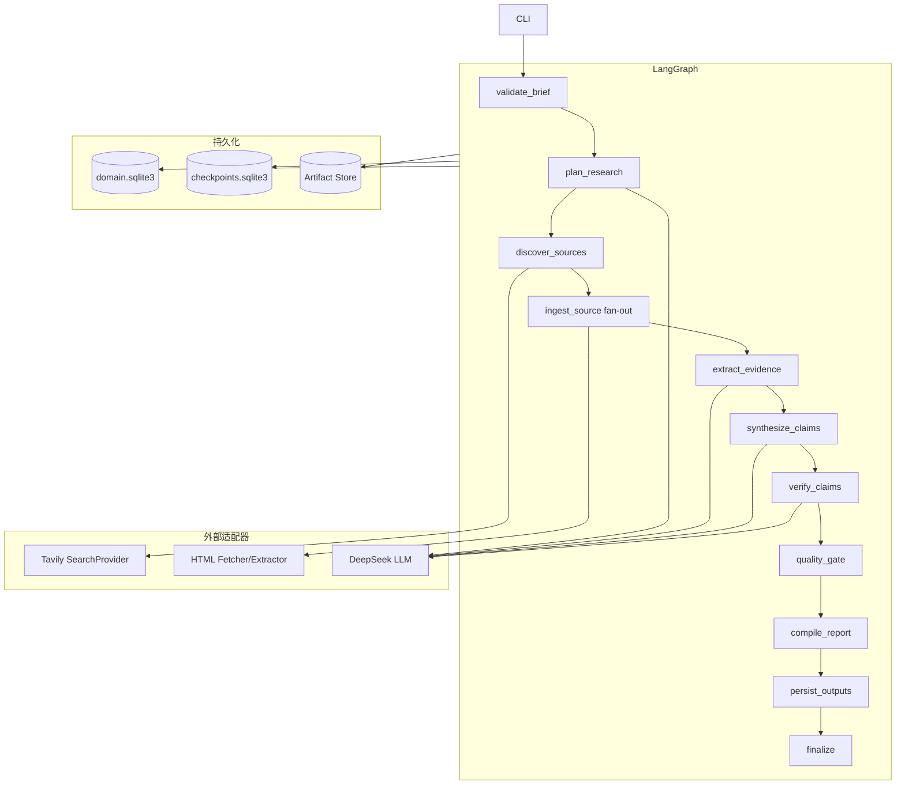

# Risk Validation POC Design

> 日期：2026-09-10  
> 状态：已完成对话评审，等待书面规格最终确认  
> 项目：Sales Research Agent  
> 阶段：阶段 0——POC 风险验证

## 1. 目标

用一个真实、受控、可重复检查的最小纵向链路，验证证据驱动型售前调研 Agent 的核心技术假设是否成立。

POC 使用海尔智家作为公开企业样例，通过 Tavily 发现真实公网来源，使用普通 HTTP 获取 HTML，使用 DeepSeek 进行结构化规划、证据候选提取、Claim 生成与语义支持核验，并通过 LangGraph 编排完整生命周期。最终输出来自同一 `ReportModel` 的 Markdown 和 HTML 报告。

POC 的首要目标是验证可信链路，不是实现缩小版完整产品。可信度是硬门槛，效率是第二目标。

## 2. 待验证假设

1. Tavily 能为中文企业研究发现至少一个可用的官方来源，并返回适合后续摄取的 URL。
2. 普通 HTTP 与静态 HTML 正文抽取足以处理 POC 中选中的部分来源。
3. DeepSeek 能稳定生成符合 Schema 的研究计划、Evidence 候选和 Claim。
4. 确定性原文定位与数字保护能够拒绝伪造或被改写的引用。
5. 语义核验能够区分“来源相关”和“证据真正支持 Claim”。
6. LangGraph 的有限 fan-out、状态 reducer 和 SQLite Checkpointer 能支持局部失败与中断恢复。
7. 单一不可变 `ReportModel` 可以生成事实和引用集合一致的 Markdown 与 HTML。
8. 在 30 分钟真实墙钟预算内，可以使用已验证事实形成可信结报。

## 3. 用户场景与固定输入

### 3.1 用户场景

售前工程师将在第二天与一个陌生客户进行首次技术交流，希望在会前获得一份可追溯的公网调研底稿，用于理解客户背景、近期变化、形成需求假设并准备验证问题。

### 3.2 POC 固定案例

- 客户：海尔智家；
- 场景：模拟首次客户技术交流；
- 数据范围：公开互联网信息；
- 研究目标：形成客户公开背景、近期公开变化、需求假设和首次交流验证问题；
- 重要声明：本案例不代表海尔智家真实存在任何模拟需求，需求假设必须明确标识为推断。

### 3.3 运行入口

POC 提供 CLI 单次运行和恢复入口，不提供正式 Web API：

```text
run      创建新 run 并执行完整 Graph
resume   使用已有 run_id 和 thread_id 从 Checkpoint 恢复
inspect  输出 run 状态、统计和 artifact 路径
```

具体命令语法由实施计划固定，但三个入口的行为边界不得改变。

## 4. 范围

### 4.1 本轮实现

- Python 3.11 工程骨架；
- CLI 单次启动与恢复；
- 最小 LangGraph 状态图；
- Tavily 真实公网搜索；
- DeepSeek OpenAI-compatible 模型调用；
- 普通 HTTP/HTTPS HTML 获取；
- 静态网页正文清洗和内容块划分；
- Source、SourceRevision、DocumentBlock、Evidence、Claim、Verification、Gap、ReportVersion 最小领域模型；
- SQLite Domain Store；
- 独立 SQLite LangGraph Checkpointer；
- 本地 Artifact Store；
- 确定性 exact/normalized 引用定位；
- 关键数字、日期、金额和百分比保护；
- DeepSeek 语义支持核验；
- 事实质量门禁；
- 单一 `ReportModel` 到 Markdown/HTML 的确定性编译；
- 结构化运行统计和审计事件；
- 单元、集成、故障注入、恢复和真实公网验收；
- POC 结论记录。

### 4.2 明确不实现

- PDF 与 MinerU；
- Playwright 动态网页降级；
- FastAPI、SSE 和正式前端；
- 多用户、身份认证、权限、租户和云部署；
- 企业内部材料；
- 多搜索 Provider；
- 完整报告全部条件章节；
- 面向客户直接交付的最终解决方案；
- 长期来源缓存和跨 run 复用；
- 分布式任务队列；
- 自动无限补研；
- 生产级 DNS rebinding 防护。

## 5. 方案选择

采用“风险纵切 POC”，不采用 Mock 优先完整骨架，也不直接开发完整 MVP。

选择理由：尽快获得真实风险证据；每项代码服务于明确假设；保持代码可演进；避免 API、前端、PDF 与多人平台同时进入导致失败原因无法定位。Mock/Fake 只用于稳定测试错误分支，不能代替至少一次真实公网端到端运行。

## 6. 技术边界

| 维度 | POC 选择 | 边界 |
|---|---|---|
| 语言 | Python 3.11 | 不继承旧项目的依赖声明 |
| 编排 | LangGraph | 顶层确定性 StateGraph |
| 模型 | LangChain/OpenAI-compatible client | DeepSeek 为首个实现 |
| 搜索 | `SearchProvider` port | Tavily 为首个实现 |
| HTTP | 异步 HTTP client | 只处理普通 HTML |
| 正文提取 | Trafilatura 候选 | 由 POC 样例决定是否保留 |
| 领域存储 | SQLite | 与 Checkpointer 分库 |
| Graph 恢复 | SQLite Checkpointer | 通过真实版本兼容测试 |
| Artifact | 本地文件系统 | 大对象不进入 Graph State |
| 报告 | ReportModel 编译 | Markdown 和 HTML 同源 |
| 测试 | pytest | 默认离线，live 显式启用 |

依赖版本不得复制项目 B 的声明。实施前从官方文档和实际解析结果确定兼容版本，并生成锁文件。

## 7. 总体架构



## 8. Graph 节点契约

### 8.1 `validate_brief`

输入固定案例 Brief；输出 `brief_id`、规范化研究目标和 `deadline_at`。必填字段缺失时在任何外部调用前失败。

### 8.2 `plan_research`

输入 Brief；输出有限的 ResearchQuestion ID。最多 4 个问题，每个问题包含目的、来源偏好和完成判据；Schema 修正最多 1 次。

### 8.3 `discover_sources`

输入研究问题；输出规范化且去重的候选 Source ID。最多选择 6 个来源，优先官方来源。搜索摘要只能筛选候选，不能成为 Evidence。

### 8.4 `ingest_source`

输入单个 `source_id`；成功返回 `source_revision_id` 和 `document_block_ids`，失败返回结构化 Failure。最大并发 3；单来源失败不抛穿 Graph；原始 HTML、清洗文本和元数据必须落盘。

### 8.5 `extract_evidence`

输入成功解析的 DocumentBlock ID；输出 Evidence 候选 ID。模型必须返回原文 quote 和对应 block，确定性定位失败的候选不得进入 APPROVED。

### 8.6 `synthesize_claims`

输入可定位 Evidence；输出 Fact、Inference 和 Question 类型 Claim ID。Fact 必须声明 Evidence ID；Inference 必须声明上游 Claim/Evidence；Question 不得伪装成事实。

### 8.7 `verify_claims`

输入 Claim 与关联 Evidence；输出 Verification ID 和初步决策。先执行确定性原文与数字检查，再执行隔离上下文的语义核验；确定性检查失败时不调用语义核验。

### 8.8 `quality_gate`

输入 Claim 与 Verification；输出通过/拒绝 Claim、Gap 和 `report_outcome`。外部 Fact 只有在 Evidence 可定位且语义支持时才能通过。拒绝 Claim 不会被 Reporter 重新生成。

### 8.9 `compile_report`

输入通过门禁的 Claim、Gap 和运行统计；输出不可变 ReportModel 与 ReportVersion。节点只消费批准后的 Claim，不得读取原始网页并生成新事实。

### 8.10 `persist_outputs`

输入 ReportModel；输出 Markdown、HTML 和 JSON artifact ID。两种报告的 Claim ID 和引用集合必须一致；外部文本在 HTML 中严格转义。

### 8.11 `finalize`

汇总运行状态、统计、报告版本与 Failure；区分 `COMPLETED`、`PARTIAL`、`NEEDS_REVIEW` 和 `FAILED`，不得用单一“完成”掩盖信息缺口。

## 9. 并行与合并

- 候选来源上限 6，最大并发 3；
- 来源分支只返回 ID 和结构化状态；
- reducer 对成功 ID、失败 ID 和 Failure 追加并稳定去重；
- 领域写入使用 `run_id + operation_type + stable_input_id` 形成幂等键；
- 恢复时已成功提交的来源不得形成新的领域实体。

## 10. Graph State

POC State 只包含以下字段：

```text
run_id
thread_id
brief_id
research_question_ids
source_ids
successful_source_ids
failed_source_ids
evidence_ids
claim_ids
approved_claim_ids
rejected_claim_ids
gap_ids
report_version_id
execution_status
report_outcome
started_at
deadline_at
failure_ids
```

正文、原始模型响应、HTML 和完整报告不得进入 Graph State。
`current_source_id` 是 `Send` 提供给单个来源分支的局部输入，不写入全局 Graph State。

## 11. 领域与文件持久化

```text
var/runs/<run_id>/
├── domain.sqlite3
├── checkpoints.sqlite3
├── sources/<source_id>/raw.html
├── sources/<source_id>/clean.txt
├── sources/<source_id>/metadata.json
├── model_responses/
├── audit.jsonl
└── reports/
    ├── report.md
    ├── report.html
    └── report-model.json
```

`domain.sqlite3` 保存最小可追溯实体、关系、验证、Failure、Gap、审计摘要和运行统计。SQLite 启用 foreign key、WAL、busy timeout 和短事务，外部调用不得发生在事务内。

`checkpoints.sqlite3` 只保存 Graph State、执行位置、pending writes 和 interrupt 相关状态，不能代替领域库，也不能作为报告事实来源。

Artifact 文件名使用系统生成 ID，不使用 URL、客户名或用户原始文件名。写入采用临时文件加原子替换；metadata 保存内容哈希、媒体类型、创建时间和生产节点。

## 12. 引用验证

顺序固定为：模型提出 Evidence quote → exact 定位 → normalized 定位 → 关键 token 一致性检查 → DeepSeek 语义支持核验 → 质量门禁。

关键 token 至少包括阿拉伯数字、百分比、金额、四位年份、完整日期和明确数量单位。如果候选 quote 在规范化后能定位，但关键 token 与原文不一致，必须拒绝并记录 `NUMERIC_MISMATCH`。

语义核验只接收当前 Claim、必要上下文、Evidence quote 和 Source metadata，不接收 Reporter 草稿。输出 `SUPPORTED`、`PARTIALLY_SUPPORTED`、`UNSUPPORTED` 或 `CONTRADICTED` 及简短理由。POC 中外部 Fact 只接受 `SUPPORTED`。

## 13. 报告模型

报告固定包含：执行摘要、客户公开事实、近期公开变化、基于事实的需求假设、首次交流验证问题、信息缺口与失败来源、来源与证据索引、本次运行统计。

每条 Fact 展示 Claim ID、引用编号和来源。Inference 必须展示“推断”标签及上游 Claim。页面必须声明本案例不代表客户真实需求。

Markdown 和 HTML 由确定性编译器读取同一个不可变 ReportModel，模型不能分别自由生成两种格式。

## 14. 异常策略

| 异常 | 策略 | 结果 |
|---|---|---|
| Key 缺失/无效 | 外部调用前失败 | `FAILED_CONFIGURATION` |
| Tavily 超时/429/5xx | 总尝试不超过 3 次 | 耗尽后记录失败 |
| 单网页超时/403/404 | 记录来源 Failure | 其他来源继续，可能 `PARTIAL` |
| 正文为空 | 不使用搜索摘要替代 | 生成 Gap |
| LLM 非结构化输出 | Schema 修正最多 1 次 | 仍失败则记录节点 Failure |
| Evidence 无法定位 | 拒绝 Evidence/Claim | 生成验证与 Gap |
| 数字或日期不一致 | 确定性拒绝 | `NUMERIC_MISMATCH` |
| Claim 不受支持 | 拒绝 Claim | 不进入事实报告 |
| 达到 deadline | 禁止新外部调用 | 使用已有可信内容结报 |
| 进程中断 | 保留领域提交和 Checkpoint | 用户显式 `resume` |

401/403 搜索认证错误、404、确定性引用失败和业务 Schema 错误不得盲目重试。

## 15. 最小安全边界

- 只允许 HTTP/HTTPS；
- 拒绝 localhost、环回、明显私网和链路本地地址；
- 每次重定向重新校验 URL；
- 限制重定向、响应体、连接超时和读取超时；
- 只接受允许的 HTML 内容类型；
- 外部网页一律标记为不可信数据；
- 网页文本不得改变 Graph 路径或调用工具；
- 模型只产生结构化候选，确定性代码决定门禁；
- HTML 报告转义全部外部文本；
- CLI 和文件默认只在本机使用，不监听端口。

## 16. 密钥与隐私

- 使用 `TAVILY_API_KEY` 与 `DEEPSEEK_API_KEY`；
- 密钥只从环境变量或本地 `.env` 读取；
- `.env` 被 Git 忽略，`.env.example` 只包含变量名；
- 密钥不得进入 Graph State、数据库、Artifact、审计、异常或夹具；
- 只使用公开企业名称和模拟场景，不使用真实实习客户或内部材料；
- 用户在对话中提供的 Tavily Key 应在 POC 后轮换。

## 17. 运行预算

- 真实墙钟预算 30 分钟；
- 研究问题最多 4 个；
- 摄取来源最多 6 个；
- 来源并发最多 3；
- 可重试操作总尝试最多 3 次；
- LLM Schema 修正最多 1 次；
- 到期后不得新发起搜索、抓取或模型调用；
- 记录搜索、HTTP、模型调用、来源结果、Claim 决策和总耗时；
- 不预设无法验证的成本节省或效率提升比例。

## 18. 测试策略

所有生产行为按 TDD 实现：先编写能因目标能力缺失而失败的测试，确认失败原因，再写最小实现并运行相关测试。

### 18.1 单元测试

Brief 校验、URL 规范化与去重、私网 URL 拒绝、quote 定位、关键 token 保护、Claim lineage、质量门禁、ReportModel 编译、双格式一致性。

### 18.2 Provider 契约测试

验证 Tavily 和 DeepSeek 响应转换，以及认证、限流、超时、5xx 与 Schema 错误分类。默认使用脱敏夹具，不访问公网。

### 18.3 摄取集成测试

使用本地 HTTP 测试站点验证 HTML、Artifact 与 hash；验证重定向、超大响应、错误内容类型、空正文和单来源失败。

### 18.4 Graph 集成测试

使用 Fake Provider 验证正常路由、fan-out 稳定合并、单来源失败后 `PARTIAL`、全部 Fact 被拒绝时只输出 Gap/Question，以及到期后不再请求外部调用。

### 18.5 恢复测试

分别在搜索完成和部分来源成功后模拟中断；恢复后领域实体与 SourceRevision 不重复，最终只产生一个 active ReportVersion。

### 18.6 真实公网验收

使用固定海尔智家 Brief并显式开启 live 标记，记录日期和 Provider，保存允许的 Artifact，由人工逐条检查报告中的全部外部 Fact，不把当次网页内容写成永久预期答案。

## 19. POC 通过条件

1. 一次真实运行在 30 分钟内生成 Markdown 和 HTML；
2. Tavily 至少发现一个可成功摄取的官方来源；
3. 全部外部 Fact 关联 SourceRevision 与可定位 Evidence；
4. 当次报告全部外部 Fact 完成人工逐条检查；
5. 预置错误引用、数字改动和无证据事实全部被拒绝；
6. 单来源故障后其他来源仍可完成；
7. 中断恢复后领域实体不重复且成功形成终态；
8. Markdown 与 HTML 的 Claim ID 和引用集合完全一致；
9. 运行记录包含真实耗时、调用次数、来源结果和 Claim 决策；
10. Git 不包含 API Key、`.env`、数据库或运行 Artifact。

研究完整度不作为 POC 通过条件，将在 MVP 评测集建立后单独衡量。

## 20. 决策门

| 决策项 | 保留条件 | 不满足时 |
|---|---|---|
| Tavily | 能发现中文企业官方来源，结构和限流可接受 | 对比其他 Provider |
| 静态 HTML | 有足够可用正文支持最小报告 | 调整解析器或 MVP 加浏览器降级 |
| DeepSeek 抽取 | 中文 Evidence 与 Schema 稳定 | 调整 Schema/Prompt 或对比模型 |
| DeepSeek 核验 | 拒绝不支持、矛盾和数字改写样例 | 隔离上下文或引入第二模型 |
| 引用定位 | 定位与数字保护通过 | 迁移项目 A 更完整算法 |
| LangGraph fan-out | 合并无覆盖、丢失或重复 | 调整 reducer 和节点粒度 |
| SQLite Checkpointer | 恢复正确且无重复副作用；并行分支的最终完成集合正确，跨分支列表顺序不作为契约 | 锁版本或调整 Saver |
| 30 分钟预算 | 在预算内可信结报 | 收紧问题、来源与调用上限 |
| HTML 报告 | 可完整阅读并快速回查 Evidence | 调整模型与模板 |

每个决策项独立给出 `KEEP`、`CHANGE` 或 `DEFER`，不能用单一“成功”掩盖局部失败。

## 21. 最终产物

- 可运行的最小 Python 包和锁文件；
- `.env.example`；
- 离线测试与显式启用的 live 运行；
- 一次海尔智家真实运行 Artifact；
- Markdown、HTML 与 ReportModel；
- 人工事实审阅记录；
- 故障注入和恢复结果；
- POC 决策门结论；
- 根据实测修订的 MVP 技术方案。

## 22. 实施顺序

```text
工程骨架
→ 可信领域内核
→ Tavily 搜索与 HTML 摄取
→ DeepSeek 结构化抽取
→ 引用核验与质量门禁
→ LangGraph 与 Checkpointer
→ ReportModel 与双格式
→ 故障注入与恢复
→ 真实运行
→ 全部事实人工审阅
→ POC 结论与 MVP 方案修订
```

## 23. 简历边界

POC 结束不等于完整项目完成。本项目只在 MVP 核心功能、自动化测试、真实案例评测和可复现运行方式完成后进入正式简历。后续只描述已经实现和验证的能力；任何准确率、耗时或效率指标都必须附带样本规模、运行日期、运行环境和计算方式。
