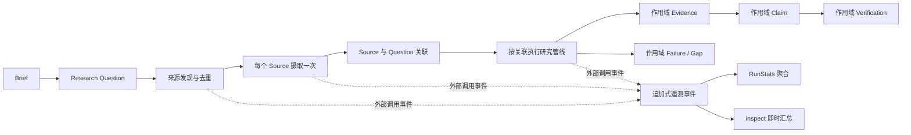

# P0 正确性收口设计

> 状态：已确认边界，等待书面规格评审  
> 日期：2026-09-12  
> 范围：并行实体身份、多问题来源覆盖、可信运行遥测、CLI 测试隔离

## 1. 目标

在不扩展产品范围、不重构持久化架构、不改变现有 Provider 和报告格式的前提下，修复本地 MVP 中四类会影响可信度、可恢复性和可验证性的 P0 问题：

1. 并行来源分支可能覆盖 Claim、Verification、Failure 和模型响应制品；
2. 同一来源关联多个研究问题时只处理第一个问题；
3. 真实运行的模型与 HTTP 调用统计可能错误显示为零，且中断运行缺少可审计统计；
4. CLI 测试可能读取开发者本地 `.env`，使测试结果依赖本机状态。

完成后，项目仍定位为本地单用户 CLI MVP；本轮不建设后台任务、SSE、审阅工作台、多人权限或云端部署。

## 2. 非目标

- 不迁移历史 SQLite 数据和 LangGraph checkpoint；
- 不修改或删除现有 `var/runs`；
- 不引入 ORM、MySQL、任务队列或 Web 框架；
- 不替换 Tavily、DeepSeek、MinerU；
- 不增加 Claim 语义去重、冲突合并或质量评分；
- 不改造当前同步 Web 入口；
- 不提交当前工作区中与本轮无关的未跟踪文件；
- 不在默认验证流程中发起真实公网请求或产生 API 费用。

## 3. 当前问题与根因

### 3.1 并行实体覆盖

每个来源分支都会独立创建 `ResearchPipeline`，但 Claim 使用 `claim-{index}`，Verification 使用 `verification-{claim_id}`，Failure 主要按操作名生成 ID。SQLite 领域表以 `id` 为全局主键，因此不同来源或问题中的同序号实体可能覆盖。

模型响应制品使用固定的 `evidence-{attempt}.json`、`claim-{attempt}.json` 和 `verification-{attempt}.json`，不同并行分支也会写入相同路径。

### 3.2 多问题覆盖丢失

来源选择允许一个 Source 关联多个 `discovered_by_question_ids`，但摄取节点只读取第一个问题。结果是正文虽然只需抓取一次，Evidence 和 Claim 却没有覆盖该来源能够回答的其他问题。

### 3.3 遥测不可信

当前 RunStats 主要在报告发布时从 Provider 对象的内存计数器读取。生产 DeepSeek 使用 `call_count`，而图节点的模型统计函数读取测试桩使用的调用列表；Fetcher 也没有生产调用计数器。进程恢复后，内存计数会丢失，中断运行在发布报告前也没有完整 RunStats。

### 3.4 测试读取本地密钥

`Settings` 默认读取项目 `.env`。CLI 测试仅删除环境变量，不能阻止 Pydantic Settings 再从 `.env` 读取密钥，因此测试结果会受到开发者工作区配置影响。

## 4. 总体架构



总体原则：

- 领域实体身份必须包含产生它的业务作用域；
- 同一业务操作恢复重跑时保持幂等，不同并行分支绝不共享实体身份；
- 正文摄取按 Source 去重，研究分析按 Source—Question 关联执行；
- 遥测以持久化调用事件为权威来源，不依赖进程内计数器；
- 对现有 CLI 和报告输出只做兼容性扩展。

## 5. 运行版本与历史兼容

### 5.1 版本规则

新运行写入 `runtime_version = 2`。历史运行缺少该字段时视为版本 1。

版本信息必须能够在不加载 LangGraph checkpoint 的情况下读取，以便 `resume` 在执行图之前进行兼容性判断。推荐把版本保存在运行目录的轻量元数据文件中，并使用现有 ArtifactStore 的原子写入能力；不为此修改所有领域表。

### 5.2 历史运行行为

- 历史报告文件保持不变并可直接查看；
- `inspect` 对版本 1 运行尽最大可能返回现有摘要，并显示 `runtime_version: 1`；
- 版本 1 运行调用 `resume` 时拒绝执行，返回明确且不包含敏感信息的兼容性错误；
- 不修改、不迁移、不删除历史 SQLite、checkpoint 或制品。

## 6. 确定性实体身份

### 6.1 ID 格式

新实体 ID 使用以下确定性作用域：

| 实体 | 格式 |
|---|---|
| ResearchQuestion | `question-{question_index}` |
| Source | `source-{source_index}` |
| Evidence | `evidence-{question_id}-{source_id}-{candidate_index}` |
| Claim | `claim-{question_id}-{source_id}-{candidate_index}` |
| Verification | `verification-{claim_id}` |
| Gap | `gap-{question_id}-{source_id}-{sequence}` |
| Failure | `failure-{question_id}-{source_id}-{operation}-{sequence}` |

没有自然 Source 的失败使用相关实体 ID 代替 `source_id`。ID 片段在进入路径或 ID 前必须使用项目内部生成的受控标识，不直接拼接 URL、客户名称、Prompt 或模型文本。

### 6.2 幂等键

operation key 继续包含 `run_id`，并与实体的完整业务作用域一致。同一节点恢复重跑时，确定性 ID 和 operation key 都保持不变；不同来源、不同问题或不同局部序号产生不同 operation key。

SQLite 继续使用当前单列 `id` 主键，不引入复合主键和数据迁移。

### 6.3 重复事实

P0 不进行语义去重。不同来源或问题产生的相似 Claim 分别保存并保留各自 Evidence 血缘。报告可以使用稳定顺序展示，但不能为了减少重复而丢弃数据。语义聚合和冲突识别作为后续独立能力评估。

## 7. 多问题来源执行模型

### 7.1 数据流

一个 URL 仍只创建一个 Source、执行一次网络摄取并保存一份正文。摄取成功后，对 `discovered_by_question_ids` 中每个问题分别执行 `ResearchPipeline`：

1. 读取一次清洗后的 DocumentBlock；
2. 按稳定顺序遍历关联问题；
3. 为每个 Source—Question 关联提取 Evidence；
4. 在同一关联作用域内合成和核验 Claim；
5. 合并各关联产生的 ID 列表，交给 LangGraph reducer 去重。

Evidence 即使引用相同原文，也按问题分别保存，避免丢失研究目的和恢复边界。

### 7.2 调用上限

保持现有最多 4 个问题、6 个来源和 3 个并发来源。只处理 Source 实际关联的问题，不构造所有问题和所有来源的笛卡尔积。最坏关联数不超过 24，真实调用量由新增遥测记录，后续根据评测数据决定是否优化。

### 7.3 失败隔离

某个 Source—Question 关联失败只记录该关联的 Failure 和 Gap，不取消同一来源的其他问题，也不阻断其他来源。正文摄取失败时，该 Source 的全部问题关联均不进入研究管线，并由来源级失败统一披露。

## 8. 模型响应制品

模型响应改为按问题、来源、操作对象和尝试次数分目录保存：

```text
model_responses/
  question-0/
    source-0/
      evidence-attempt-1.json
      evidence-attempt-2.json
      claim-attempt-1.json
      verification-claim-question-0-source-0-0-attempt-1.json
```

同一业务操作恢复重跑时允许确定性覆盖自己的同名制品；不同分支不得写入同一路径。现有密钥脱敏逻辑保持不变，路径中不得包含外部输入或敏感内容。

## 9. 持久化遥测

### 9.1 权威数据源

每次真实外部请求通过两阶段审计事件记录：紧邻网络 I/O 之前追加 `CALL_STARTED`，请求结束后追加同一 `call_id` 的 `CALL_FINISHED`。RunStats 和 `inspect` 从这些事件聚合，不再以 Provider 内存计数器作为生产环境权威来源。

新增一个窄的 `ExternalCallRecorder` 协议和基于现有 Repository 的实现。Fetcher 和三个 Provider 只依赖该协议，不直接依赖 SQLite。CLI 装配阶段向真实实现注入 recorder；单元测试可注入内存 recorder。协议负责：

1. 在请求前生成唯一 `call_id` 并持久化开始事件；
2. 在请求结束后按相同 `call_id` 持久化结果、耗时和状态；
3. 对敏感字段执行白名单约束，调用方不能传入任意请求正文；
4. 在遥测写入失败时记录受控领域 Failure，但不得把密钥或请求正文写入错误消息。

调用事件至少包含：

| 字段 | 含义 |
|---|---|
| `event_type` | `CALL_STARTED` 或 `CALL_FINISHED` |
| `call_id` | 单次真实请求尝试的唯一标识 |
| `provider` | Tavily、DeepSeek、MinerU 或 HTTP Fetcher |
| `operation` | 搜索、抓取、计划、提取、合成、核验、PDF 提交或轮询 |
| `attempt` | 当前操作的请求尝试序号 |
| `status` | finished 事件中的成功、超时、网络失败、Schema 失败或 HTTP 失败 |
| `duration_ms` | 本次真实请求耗时 |
| `occurred_at` | UTC 时间 |
| `related_entity_id` | 问题、来源、Claim 或其他受控实体 ID |

调用事件禁止记录 API 密钥、Authorization、完整 Prompt、用户背景和完整响应正文。

### 9.2 统计口径

| 指标 | 定义 |
|---|---|
| `search_calls` | 实际发给搜索 Provider 的请求数，含重试 |
| `http_calls` | 实际网页 HTTP 请求数，含重试和重定向 |
| `pdf_calls` | 实际 MinerU 提交和轮询请求数 |
| `model_calls` | 实际模型服务请求数，含 Schema 重试 |
| `duration_seconds` | 运行开始到当前时间或结束时间的墙钟耗时 |

测试 Fake 可以继续保留自己的 calls 列表用于单元断言，但生产 RunStats 不从这些列表推断。

### 9.3 中断与恢复

调用事件先于后续领域处理结果持久化。统计以不同 `call_id` 的 `CALL_STARTED` 数量为请求尝试次数；有 started、没有 finished 的调用显示为 `in_flight_or_interrupted`。这是外部网络 I/O 与本地 SQLite 无法形成同一原子事务时的明确一致性边界：极端情况下进程可能在 started 落盘后、实际发包前崩溃，因此统计表达“准备并尝试发起的外部调用”，不会声称具备分布式恰好一次语义。

恢复后的真实新请求必须产生新的 `call_id` 并计为新调用；只有被 LangGraph checkpoint 完整跳过、没有重新发起网络 I/O 的节点才不会新增调用事件。历史请求不会因 Provider 对象重建而归零。

## 10. `inspect` 契约

现有字段保持不删除，并增加：

```json
{
  "run_id": "example",
  "runtime_version": 2,
  "execution_status": "FINISHED",
  "report_outcome": "COMPLETED",
  "started_at": "2026-09-12T00:00:00Z",
  "finished_at": "2026-09-12T00:01:35Z",
  "duration_seconds": 95.0,
  "questions": 4,
  "sources": 6,
  "sources_succeeded": 6,
  "sources_failed": 0,
  "official_sources_succeeded": 1,
  "claims_approved": 5,
  "claims_rejected": 13,
  "search_calls": 4,
  "http_calls": 7,
  "pdf_calls": 0,
  "model_calls": 31,
  "failures": 0,
  "report_path": "reports/report.md"
}
```

执行状态固定为 `RUNNING | FINISHED | FAILED`。报告结果固定为 `COMPLETED | PARTIAL | NEEDS_REVIEW | FAILED`。

确定性判定规则：

- 没有任何批准 Fact：`FAILED`；
- 存在来源失败、未覆盖问题或关键 Gap：`PARTIAL`；
- 通过系统门禁但仍等待未来人工审阅流程：预留 `NEEDS_REVIEW`，当前 P0 不主动产生；
- 其余情况：`COMPLETED`。

## 11. CLI 配置与编码

生产 `Settings` 继续默认读取项目 `.env`。测试必须在没有 `.env` 的临时工作目录执行，并显式清理相关环境变量，确保：

- 开发者是否配置真实密钥不影响结果；
- 测试不会读取或输出真实密钥；
- 测试不会发起公网请求；
- 测试结束后 pytest 自动恢复工作目录和环境变量。

CLI 错误断言只依赖稳定文本内容，不依赖 Typer/Rich 边框和颜色。中文源码、页面和报告继续使用 UTF-8；验证需要覆盖 PowerShell UTF-8 环境下的中文错误输出，不更换 CLI 框架。

## 12. 文件职责与预计改动范围

| 文件 | 职责与改动方向 |
|---|---|
| `src/sales_research_agent/runtime.py` | 接收 Source—Question 作用域，生成唯一实体 ID 和分支制品路径 |
| `src/sales_research_agent/graph/nodes.py` | 对来源关联的全部问题执行管线，聚合持久化遥测和运行结果 |
| `src/sales_research_agent/graph/state.py` | 仅在运行版本或状态字段确有需要时做兼容扩展 |
| `src/sales_research_agent/cli.py` | 创建运行版本元数据、恢复版本检查、扩展 inspect 输出 |
| `src/sales_research_agent/infrastructure/sqlite_repository.py` | 提供读取和聚合审计事件的窄接口 |
| `src/sales_research_agent/domain/repository.py` | 声明新增的窄 Repository 契约 |
| `src/sales_research_agent/domain/models.py` | 定义运行版本或调用事件的严格模型 |
| `src/sales_research_agent/infrastructure/telemetry.py` | 定义窄 recorder 协议并把两阶段调用事件写入审计存储 |
| `src/sales_research_agent/providers/deepseek.py` | 在真实请求边界记录模型调用事件 |
| `src/sales_research_agent/providers/tavily.py` | 在真实请求边界记录搜索调用事件 |
| `src/sales_research_agent/providers/mineru.py` | 在提交和轮询请求边界记录 PDF 调用事件 |
| `src/sales_research_agent/ingestion/fetcher.py` | 在每次实际 HTTP 请求边界记录抓取调用事件 |
| `tests/fakes.py` | 支持多问题、多来源和遥测场景的稳定测试桩 |
| `tests/unit/test_cli.py` | 隔离 `.env`，覆盖版本拒绝和扩展 inspect |
| `tests/unit/test_graph_nodes.py` | 覆盖关联问题遍历和统计聚合 |
| `tests/integration/test_poc_graph.py` | 覆盖并行实体不覆盖、正文只摄取一次 |
| `tests/fault_injection/test_graph_recovery.py` | 覆盖恢复幂等和调用事件累计 |
| `README.md` | 更新实际测试结果和 inspect 示例 |
| `docs/mvp-acceptance-checklist.md` | 记录 P0 收口后的验收证据 |

实现阶段应优先复用现有文件和类型；只有当调用事件模型无法清晰归属时，才创建单一职责的新模块，不进行无关目录重构。

## 13. 测试设计

实施严格采用测试先行。必须覆盖：

1. 两个来源分别产生局部 `claim-0` 时，数据库保存两条不同 Claim；
2. 对应 Verification 均指向正确 Claim 和 Evidence；
3. 两个并行分支发生相同错误码时保存两条 Failure；
4. 同一分支恢复执行时不重复 Claim、Verification 和 Failure；checkpoint 跳过的外部请求不增加事件，真实重发请求产生新的调用事件；
5. 同一来源关联两个问题时，两条研究管线都执行；
6. 多问题执行时网络摄取和 DocumentBlock 只产生一次；
7. 各分支模型响应制品路径不同且内容不覆盖；
8. 搜索、HTTP、PDF 和模型的重试次数按真实请求口径累计；
9. 报告发布前中断时，`inspect` 仍返回当前调用量和耗时；
10. 存在项目 `.env` 时，缺少密钥的 CLI 测试仍按测试输入稳定失败；
11. 版本 1 运行可以 inspect，但 resume 被明确拒绝；
12. 离线端到端报告、Markdown/HTML 一致性和现有安全测试继续通过。

## 14. 验收门槛

### 14.1 强制离线验收

```powershell
.\.venv\Scripts\python.exe -m pytest -q
.\.venv\Scripts\ruff.exe check .
.\.venv\Scripts\mypy.exe src
git status --short --branch
```

通过标准：

- pytest 无失败，live 测试保持显式排除；
- Ruff 和 Mypy 无问题；
- 没有新增未预期制品；
- 当前两个无关未跟踪文件不被修改或提交；
- 中文文件可以按 UTF-8 正确读取，不出现新乱码。

### 14.2 可选真实公网验收

真实运行只在用户明确授权 API 调用和费用后执行。优先使用比亚迪案例，核对：

- `model_calls` 和 `http_calls` 与实际外部请求一致且不再错误为零；
- 多问题关联均留下可审计实体；
- Claim、Verification 和模型响应制品没有分支覆盖；
- 报告在 30 分钟预算内形成明确终态；
- 日志、数据库和制品不包含密钥。

## 15. 实施拆分与回滚边界

实现计划应拆成四个可独立验证和回滚的改造包：

1. 并行实体身份与制品隔离；
2. 多问题来源覆盖；
3. 持久化调用遥测与 inspect；
4. CLI 配置测试隔离及文档校准。

每个改造包先增加失败测试，再做最小实现，再运行针对性测试和全量离线检查。任何一个包失败时都可以单独回滚，不要求同时回滚其他已经通过验收的包。

## 16. 风险与控制

| 风险 | 影响 | 控制方式 |
|---|---|---|
| 修复 ID 后报告 Fact 数增加 | 报告可能出现相似事实 | P0 保留血缘，不做有损语义去重，后续用评测决定聚合方案 |
| 多问题分析增加模型调用 | 成本和时延上升 | 只处理真实关联，保留 4 问题、6 来源上限并持久化调用量 |
| 遥测写入增加 SQLite 并发 | 可能增加短事务竞争 | 使用追加式短事务和现有 busy timeout，不把网络调用放进事务 |
| 调用事件统计边界 | 进程可能在 started 落盘后、实际发包前崩溃 | 明确统计为请求尝试；started/finished 通过 call_id 配对并单独披露中断调用 |
| 旧 checkpoint 被误恢复 | 产生不可预测状态 | 图执行前检查 runtime version，版本 1 明确拒绝恢复 |
| 测试意外读取密钥 | 安全和可重复性受损 | 临时工作目录、环境变量清理和禁止公网的测试桩三层隔离 |

## 17. 完成定义

只有同时满足以下条件，四个 P0 才视为解决：

- 不同并行分支不再覆盖 Claim、Verification、Failure 或模型响应制品；
- 同一来源关联的全部研究问题都进入 Evidence—Claim 管线；
- 同一运行恢复后不产生重复领域实体；被 checkpoint 跳过的请求不新增事件，真实重发请求如实新增事件；
- RunStats 和 `inspect` 由持久化真实调用事件生成；
- 中断运行也能返回当前状态、耗时和调用统计；
- CLI 测试不受开发者 `.env` 影响；
- 全量离线测试、Ruff、Mypy 全部通过；
- 历史运行文件没有被修改；
- CLI 命令、现有 Provider、报告格式和 Web 入口没有无关行为变化。
